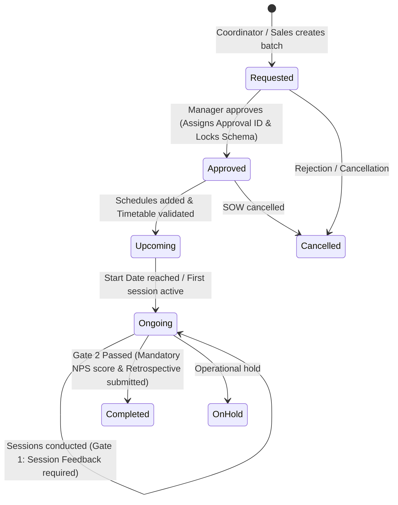

# Batches Table Schema Implementation Document
## Enterprise 3-Workflow Operations & Faculty Utilization Platform

---

## 1. Executive Summary & Objective

This document defines the **production-grade database schema specification, SQLAlchemy ORM implementation, Pydantic validation schemas, and migration strategy** for the `batches` table in the Enterprise Operations & Faculty Utilization Platform.

The schema standardizes and unifies over **3,510 legacy batch records** currently scattered across multiple heterogeneous Excel sheets (`Enrollment`, `Sheet1`, `Cancelled`, `Feedback`, and `GNU Data` in `1.MBR_Active Batches.xlsx`), providing strict type safety, relational integrity, role-based access control, schema locking, and integration with the platform's **2 Quality Checkpoints**.

> [!NOTE]
> Per schema refinement requirements, legacy spreadsheet artifacts (`SL No.`), organizational hierarchy (`Group/Entity`), relational client foreign keys (`Client ID`), business model tags (`B2B/B2C`), commercial pricing (`Billing Amount`), and financial reporting fiscal years (`FY`) have been omitted to streamline the operational data model.

```mermaid
flowchart TD
    subgraph S1[Legacy Excel Ingestion / Manual Creation]
        EXCEL[1.MBR_Active Batches.xlsx\n(Streamlined Active Columns)]
        UI_FORM[Coordinator Web UI Form]
    end

    subgraph S2[Data Transformation & Validation]
        NORM[Data Normalization Engine\n- Date parsing (UTC TIMESTAMPTZ)\n- String trimming & Enum normalization\n- Numeric cleaning]
        PYD[Pydantic v2 Schema Validation\nBatchCreate / BatchUpdate]
    end

    subgraph S3[PostgreSQL Core Relational Engine]
        BATCH_TBL[(batches Table\n- UUIDv4 Primary Key\n- Immutable batch_id Unique Index\n- Foreign Keys to users\n- Streamlined Operational Attributes)]
    end

    subgraph S4[Lifecycle & Governance Gates]
        LOCK[Manager Approval & Schema Lock\nStatus: Requested -> Approved]
        GATE2[Gate 2: NPS Closure Guard\nMandatory NPS & Retrospective Notes]
    end

    EXCEL --> NORM
    UI_FORM --> PYD
    NORM --> PYD
    PYD --> BATCH_TBL
    BATCH_TBL --> LOCK
    LOCK --> GATE2
```

---

## 2. Complete Column Mapping Matrix (Excel $\to$ PostgreSQL)

Below is the exhaustive mapping of all active columns from the operational Excel sheet (`1.MBR_Active Batches.xlsx` - `Enrollment` / `Sheet1` / `Cancelled`) to the normalized PostgreSQL database columns:

| # | Excel Column Name | DB Column Name | PostgreSQL Data Type | SQLAlchemy Type | Pydantic Type | Nullable | Default | Description / Business Meaning | Sample Excel Values |
| :- | :--- | :--- | :--- | :--- | :--- | :---: | :---: | :--- | :--- |
| **1** | `Approval ID` | `approval_id` | `VARCHAR(100)` | `String(100)` | `Optional[str]` | Yes | `None` | Financial SOW reference or Manager Approval ID. Assigned on approval. | `SOW-2026-DEL-089`, `SOW-IBM-44` |
| **2** | `Program Location` | `location_city` | `VARCHAR(100)` | `String(100)` | `Optional[str]` | Yes | `None` | Delivery city or primary geographic location. | `Bengaluru`, `Hyderabad`, `Remote` |
| **3** | `Category` | `category` | `VARCHAR(100)` | `String(100)` | `str` | No | `'Bootcamp'` | Delivery format category. | `Bootcamp`, `RBT`, `PJP`, `Workshop` |
| **4** | `Mode ( F2F,online/blended)` | `delivery_mode` | `VARCHAR(50)` | `String(50)` | `str` | No | `'Online'` | Training delivery mode. | `Online`, `F2F`, `Blended`, `Offline` |
| **5** | `Client` | `client_name` | `VARCHAR(255)` | `String(255)` | `Optional[str]` | Yes | `None` | Client account name string. | `Deloitte USI`, `Capgemini`, `IBM` |
| **6** | `R/NR` / `Residential?` | `residential_type` | `VARCHAR(20)` | `String(20)` | `str` | No | `'NR'` | Residential program classification (`R` vs `NR`). | `R`, `NR`, `Non-Residential` |
| **7** | `ProgramName` | `program_name` | `VARCHAR(255)` | `String(255)` | `str` | No | *Required* | Official title of the training program / curriculum. | `Enterprise Big Data & Spark Immersion` |
| **8** | `Batch ID` | `batch_id` | `VARCHAR(255)` | `String(255)` | `str` | No | *Unique Index* | Immutable, unique batch identifier. | `DTA_PysparkScala_SOW56_ILT_B2` |
| **9** | `Technology` | `technology` | `VARCHAR(255)` | `String(255)` | `Optional[str]` | Yes | `None` | Technology stack, framework, or tools taught. | `PySpark, Scala, Databricks`, `DotNet` |
| **10** | `Domain` | `domain` | `VARCHAR(100)` | `String(100)` | `Optional[str]` | Yes | `None` | High-level technology domain / vertical area. | `IT/ITES`, `Data Science`, `Cloud` |
| **11** | `Start Date` | `start_date` | `TIMESTAMPTZ` | `DateTime(timezone=True)` | `Optional[datetime]` | Yes | `None` | Batch commencement timestamp in UTC. | `2026-03-01 09:00:00+00` |
| **12** | `End Date` | `end_date` | `TIMESTAMPTZ` | `DateTime(timezone=True)` | `Optional[datetime]` | Yes | `None` | Batch scheduled completion timestamp in UTC. | `2026-03-31 18:00:00+00` |
| **13** | `Batch Request Date` | `batch_request_date`| `TIMESTAMPTZ` | `DateTime(timezone=True)` | `Optional[datetime]` | Yes | `None` | Date when batch request was initially submitted. | `2026-02-15 10:00:00+00` |
| **14** | `Training days` | `training_days` | `INTEGER` | `Integer` | `int` | No | `0` | Total scheduled working/training days. | `15`, `30`, `45` |
| **15** | `Calender days` | `calendar_days` | `INTEGER` | `Integer` | `Optional[int]` | Yes | `0` | Elapsed calendar duration between start and end date. | `31`, `90`, `180` |
| **16** | `Total Hours` | `total_hours` | `NUMERIC(8, 2)`| `Numeric(8, 2)` | `Decimal` | No | `0.00` | Total planned training hours for the entire batch. | `120.00`, `240.00` |
| **17** | `Total Enrollments` | `total_enrollments`| `INTEGER` | `Integer` | `int` | No | `0` | Total enrolled candidate headcount. | `45`, `120`, `1612` |
| **18** | `Resi. Enrollments` | `residential_enrollments`| `INTEGER` | `Integer` | `int` | No | `0` | Count of residential students. | `0`, `30`, `45` |
| **19** | `Enrolments` / `NR` | `non_residential_enrollments`| `INTEGER`| `Integer` | `int` | No | `0` | Count of non-residential students. | `15`, `90`, `1612` |
| **20** | `Status` / `Program Status`| `status` | `VARCHAR(50)` | `String(50)` | `str` | No | `'Requested'` | Lifecycle state machine status. | `Requested`, `Approved`, `Ongoing`, `Completed` |
| **21** | `Batch Avg Feedback*` | `batch_avg_feedback`| `NUMERIC(3, 2)`| `Numeric(3, 2)` | `Optional[Decimal]` | Yes | `None` | Aggregated student feedback score (1.00 - 5.00). | `4.46`, `4.82` |
| **22** | `Total Feedback` | `total_feedback_score`| `NUMERIC(10, 2)`| `Numeric(10, 2)` | `Optional[Decimal]` | Yes | `None` | Cumulative feedback rating points across all responses. | `7092.80`, `1320.10` |
| **23** | `Batch NPS*` | `batch_nps` | `NUMERIC(4, 2)`| `Numeric(4, 2)` | `Optional[Decimal]` | Yes | `None` | Net Promoter Score (Scale: 0.00 to 10.00 or -100 to 100). | `8.50`, `9.20` |
| **24** | `Program Manager` | `primary_manager_id`| `UUID` | `UUID(as_uuid=True)` | `Optional[UUID]` | Yes | `None` | FK referencing `users.id` (Delivery Manager). | `uuid4` |
| **25** | `Coordinator` | `coordinator_id` | `UUID` | `UUID(as_uuid=True)` | `Optional[UUID]` | Yes | `None` | FK referencing `users.id` (Operations Coordinator). | `uuid4` |
| **26** | `Sales SPOC` | `sales_spoc_id` | `UUID` | `UUID(as_uuid=True)` | `Optional[UUID]` | Yes | `None` | FK referencing `users.id` (Enterprise Sales SPOC). | `uuid4` |
| **27** | `Faculty assigned` | `faculty_assigned_text`| `VARCHAR(500)`| `String(500)` | `Optional[str]` | Yes | `None` | Legacy raw faculty names string for reference. | `Nagabhushan / Srinivas P`, `Rashmi` |
| **28** | `Finance Status Check` | `finance_status` | `VARCHAR(50)` | `String(50)` | `str` | No | `'Pending'` | Financial milestone status. | `Pending`, `Cleared`, `Invoiced`, `Settled` |
| **29** | `Remarks` | `remarks` | `TEXT` | `Text` | `Optional[str]` | Yes | `None` | Operational remarks, delivery adjustments, client notes. | `Moved Online due to lockdown` |
| **30** | `Comments` / `Spoc` | `comments` | `TEXT` | `Text` | `Optional[str]` | Yes | `None` | Internal operations notes or legacy SPOC reference. | `Client requested additional Spark module` |
| **31** | *(System Flag)* | `is_schema_locked` | `BOOLEAN` | `Boolean` | `bool` | No | `False` | Immutable lock flag activated upon Manager Approval. | `True`, `False` |
| **32** | *(Gate 2)* | `retrospective_notes`| `TEXT` | `Text` | `Optional[str]` | Yes | `None` | Mandatory batch retrospective submission for Gate 2 closure. | `Delivered on time with 92% attendance` |
| **33** | *(Audit)* | `created_at` | `TIMESTAMPTZ` | `DateTime(timezone=True)` | `datetime` | No | `now(utc)` | UTC creation timestamp. | `2026-03-01 10:00:00+00` |
| **34** | *(Audit)* | `updated_at` | `TIMESTAMPTZ` | `DateTime(timezone=True)` | `datetime` | No | `now(utc)` | UTC last updated timestamp. | `2026-03-09 14:30:00+00` |

---

## 3. Database Constraints, Enums & Integrity Rules

### 3.1 Enumerations & Standardized Values

> [!IMPORTANT]
> The database enforces standardized string values with application-level and database `CHECK` constraints to prevent data drift:

```sql
-- Status State Machine
CHECK (status IN ('Requested', 'Approved', 'Upcoming', 'Ongoing', 'Completed', 'Cancelled', 'OnHold'))

-- Delivery Mode
CHECK (delivery_mode IN ('Online', 'F2F', 'Blended', 'Offline'))

-- Residential Classification
CHECK (residential_type IN ('R', 'NR', 'Blended'))

-- Financial Milestone Status
CHECK (finance_status IN ('Pending', 'Cleared', 'Invoiced', 'Settled', 'OnHold'))
```

### 3.2 Key Business Logic Constraints

1. **Enrollment Headcount Integrity**:
   $$\text{total\_enrollments} \ge \text{residential\_enrollments} + \text{non\_residential\_enrollments}$$
2. **Date Range Sanity**:
   $$\text{end\_date} \ge \text{start\_date}$$
3. **Feedback Rating Range**:
   $$1.00 \le \text{batch\_avg\_feedback} \le 5.00$$
4. **NPS Score Range**:
   $$-100.00 \le \text{batch\_nps} \le 100.00 \quad \text{or} \quad 0.00 \le \text{batch\_nps} \le 10.00$$

---

## 4. Drop-in Production SQLAlchemy Model (`models/batch.py`)

Below is the complete, typed SQLAlchemy 2.0 ORM model:

```python
"""
SQLAlchemy ORM Model for Batches Table
Location: backend/app/models/batch.py
"""

import uuid
from datetime import datetime, timezone
from decimal import Decimal
from sqlalchemy import (
    Column, String, Boolean, DateTime, Integer, Numeric, Text,
    ForeignKey, CheckConstraint, Index
)
from sqlalchemy.dialects.postgresql import UUID
from sqlalchemy.orm import relationship
from app.core.database import Base


class Batch(Base):
    __tablename__ = "batches"

    # Primary Key
    id = Column(UUID(as_uuid=True), primary_key=True, default=uuid.uuid4)

    # Identifiers
    batch_id = Column(String(255), unique=True, index=True, nullable=False)  # Immutable unique batch key
    approval_id = Column(String(100), nullable=True, index=True)  # Financial SOW Approval ID

    # Program & Category Classification
    category = Column(String(100), nullable=False, default="Bootcamp")  # Bootcamp, RBT, PJP, Workshop
    residential_type = Column(String(20), nullable=False, default="NR")  # R, NR
    program_name = Column(String(255), nullable=False, index=True)
    technology = Column(String(255), nullable=True)  # PySpark, Databricks, Java FullStack
    domain = Column(String(100), nullable=True)  # IT/ITES, Cloud, DS/ML, CyberSecurity

    # Client Account
    client_name = Column(String(255), nullable=True, index=True)

    # Delivery Logistics & Timeline
    delivery_mode = Column(String(50), nullable=False, default="Online")  # Online, F2F, Blended
    location_city = Column(String(100), nullable=True)  # Bengaluru, Hyderabad, Mumbai, Remote
    start_date = Column(DateTime(timezone=True), nullable=True, index=True)
    end_date = Column(DateTime(timezone=True), nullable=True, index=True)
    batch_request_date = Column(DateTime(timezone=True), nullable=True)
    training_days = Column(Integer, default=0, nullable=False)
    calendar_days = Column(Integer, default=0, nullable=True)
    total_hours = Column(Numeric(8, 2), default=Decimal("0.00"), nullable=False)

    # Student Headcount Breakdown
    total_enrollments = Column(Integer, default=0, nullable=False)
    residential_enrollments = Column(Integer, default=0, nullable=False)
    non_residential_enrollments = Column(Integer, default=0, nullable=False)

    # Lifecycle State & Governance Lock
    status = Column(String(50), default="Requested", nullable=False, index=True)
    is_schema_locked = Column(Boolean, default=False, nullable=False)

    # Ownership & Operational Roles
    primary_manager_id = Column(UUID(as_uuid=True), ForeignKey("users.id", ondelete="SET NULL"), nullable=True, index=True)
    coordinator_id = Column(UUID(as_uuid=True), ForeignKey("users.id", ondelete="SET NULL"), nullable=True, index=True)
    sales_spoc_id = Column(UUID(as_uuid=True), ForeignKey("users.id", ondelete="SET NULL"), nullable=True, index=True)
    faculty_assigned_text = Column(String(500), nullable=True)  # Legacy faculty string

    # Financial Milestone Status
    finance_status = Column(String(50), default="Pending", nullable=False)  # Pending, Cleared, Invoiced

    # Quality Checkpoint Metrics (Gate 1 & Gate 2)
    batch_avg_feedback = Column(Numeric(3, 2), nullable=True)  # 1.00 - 5.00
    total_feedback_score = Column(Numeric(10, 2), nullable=True)  # Cumulative rating score
    batch_nps = Column(Numeric(4, 2), nullable=True)  # NPS Score (0-10 or -100 to 100)
    retrospective_notes = Column(Text, nullable=True)

    # Remarks & Notes
    remarks = Column(Text, nullable=True)
    comments = Column(Text, nullable=True)

    # Audit Timestamps (UTC)
    created_at = Column(DateTime(timezone=True), default=lambda: datetime.now(timezone.utc), nullable=False)
    updated_at = Column(
        DateTime(timezone=True),
        default=lambda: datetime.now(timezone.utc),
        onupdate=lambda: datetime.now(timezone.utc),
        nullable=False
    )

    # Relationships
    primary_manager = relationship("User", foreign_keys=[primary_manager_id], back_populates="primary_managed_batches")
    coordinator = relationship("User", foreign_keys=[coordinator_id], back_populates="coordinated_batches")
    sales_spoc = relationship("User", foreign_keys=[sales_spoc_id], back_populates="sales_batches")
    sessions = relationship("TrainingSession", back_populates="batch", cascade="all, delete-orphan")
    co_managers = relationship("BatchCoManager", back_populates="batch", cascade="all, delete-orphan")
    nps_closure = relationship("BatchNpsClosure", back_populates="batch", uselist=False, cascade="all, delete-orphan")

    # Table Constraints & Composite Indexes
    __table_args__ = (
        CheckConstraint(
            "status IN ('Requested', 'Approved', 'Upcoming', 'Ongoing', 'Completed', 'Cancelled', 'OnHold')",
            name="ck_batch_status_valid"
        ),
        CheckConstraint(
            "delivery_mode IN ('Online', 'F2F', 'Blended', 'Offline')",
            name="ck_batch_delivery_mode_valid"
        ),
        Index("ix_batches_status_start_date", "status", "start_date"),
        Index("ix_batches_manager_status", "primary_manager_id", "status"),
        Index("ix_batches_client_status", "client_name", "status"),
    )
```

---

## 5. Pydantic v2 Schemas (`schemas/batch.py`)

Below is the complete Pydantic v2 data contract supporting CRUD, Manager Approvals, and Gate 2 NPS closures:

```python
"""
Pydantic v2 Validation Schemas for Batches
Location: backend/app/schemas/batch.py
"""

from typing import Optional, List
from uuid import UUID
from datetime import datetime
from decimal import Decimal
from pydantic import BaseModel, Field, ConfigDict
from app.schemas.user import UserResponse


class BatchBase(BaseModel):
    batch_id: str = Field(..., min_length=3, max_length=255, description="Unique immutable batch identifier")
    approval_id: Optional[str] = Field(None, max_length=100, description="Financial SOW Approval ID")
    category: str = Field("Bootcamp", description="Bootcamp, RBT, PJP, Workshop")
    residential_type: str = Field("NR", description="R, NR")
    program_name: str = Field(..., min_length=2, max_length=255)
    technology: Optional[str] = Field(None, max_length=255)
    domain: Optional[str] = Field(None, max_length=100)
    client_name: Optional[str] = Field(None, max_length=255)
    delivery_mode: str = Field("Online", description="Online, F2F, Blended")
    location_city: Optional[str] = Field(None, max_length=100)
    start_date: Optional[datetime] = None
    end_date: Optional[datetime] = None
    batch_request_date: Optional[datetime] = None
    training_days: int = Field(0, ge=0)
    calendar_days: Optional[int] = Field(0, ge=0)
    total_hours: Decimal = Field(Decimal("0.00"), ge=Decimal("0.00"))
    total_enrollments: int = Field(0, ge=0)
    residential_enrollments: int = Field(0, ge=0)
    non_residential_enrollments: int = Field(0, ge=0)
    status: str = Field("Requested", description="Requested, Approved, Upcoming, Ongoing, Completed, Cancelled, OnHold")
    primary_manager_id: Optional[UUID] = None
    coordinator_id: Optional[UUID] = None
    sales_spoc_id: Optional[UUID] = None
    faculty_assigned_text: Optional[str] = None
    finance_status: str = Field("Pending", max_length=50)
    remarks: Optional[str] = None
    comments: Optional[str] = None


class BatchCreate(BatchBase):
    pass


class BatchApprove(BaseModel):
    approval_id: str = Field(..., min_length=3, max_length=100, description="Financial SOW or Manager Approval Reference")


class BatchUpdate(BaseModel):
    approval_id: Optional[str] = None
    category: Optional[str] = None
    residential_type: Optional[str] = None
    program_name: Optional[str] = None
    technology: Optional[str] = None
    domain: Optional[str] = None
    client_name: Optional[str] = None
    delivery_mode: Optional[str] = None
    location_city: Optional[str] = None
    start_date: Optional[datetime] = None
    end_date: Optional[datetime] = None
    batch_request_date: Optional[datetime] = None
    training_days: Optional[int] = None
    calendar_days: Optional[int] = None
    total_hours: Optional[Decimal] = None
    total_enrollments: Optional[int] = None
    residential_enrollments: Optional[int] = None
    non_residential_enrollments: Optional[int] = None
    status: Optional[str] = None
    primary_manager_id: Optional[UUID] = None
    coordinator_id: Optional[UUID] = None
    sales_spoc_id: Optional[UUID] = None
    faculty_assigned_text: Optional[str] = None
    finance_status: Optional[str] = None
    remarks: Optional[str] = None
    comments: Optional[str] = None


class BatchResponse(BatchBase):
    id: UUID
    is_schema_locked: bool
    batch_avg_feedback: Optional[Decimal] = None
    total_feedback_score: Optional[Decimal] = None
    batch_nps: Optional[Decimal] = None
    retrospective_notes: Optional[str] = None
    created_at: datetime
    updated_at: datetime

    model_config = ConfigDict(from_attributes=True)


class BatchDetailResponse(BatchResponse):
    primary_manager: Optional[UserResponse] = None
    coordinator: Optional[UserResponse] = None
    sales_spoc: Optional[UserResponse] = None

    model_config = ConfigDict(from_attributes=True)
```

---

## 6. Alembic Database Migration DDL

Below is the standard Alembic migration script for creating the updated `batches` table with all indexes and constraints:

```python
"""add_streamlined_batches_schema

Revision ID: 002_batches_streamlined
Revises: 001_initial_schema
Create Date: 2026-09-09 20:25:00.000000

"""
from alembic import op
import sqlalchemy as sa
from sqlalchemy.dialects import postgresql

# revision identifiers
revision = '002_batches_streamlined'
down_revision = None
branch_labels = None
depends_on = None


def upgrade():
    op.create_table(
        'batches',
        sa.Column('id', postgresql.UUID(as_uuid=True), primary_key=True, server_default=sa.text('gen_random_uuid()')),
        sa.Column('batch_id', sa.String(length=255), nullable=False),
        sa.Column('approval_id', sa.String(length=100), nullable=True),
        sa.Column('category', sa.String(length=100), nullable=False, server_default='Bootcamp'),
        sa.Column('residential_type', sa.String(length=20), nullable=False, server_default='NR'),
        sa.Column('program_name', sa.String(length=255), nullable=False),
        sa.Column('technology', sa.String(length=255), nullable=True),
        sa.Column('domain', sa.String(length=100), nullable=True),
        sa.Column('client_name', sa.String(length=255), nullable=True),
        sa.Column('delivery_mode', sa.String(length=50), nullable=False, server_default='Online'),
        sa.Column('location_city', sa.String(length=100), nullable=True),
        sa.Column('start_date', sa.DateTime(timezone=True), nullable=True),
        sa.Column('end_date', sa.DateTime(timezone=True), nullable=True),
        sa.Column('batch_request_date', sa.DateTime(timezone=True), nullable=True),
        sa.Column('training_days', sa.Integer(), nullable=False, server_default='0'),
        sa.Column('calendar_days', sa.Integer(), nullable=True, server_default='0'),
        sa.Column('total_hours', sa.Numeric(precision=8, scale=2), nullable=False, server_default='0.00'),
        sa.Column('total_enrollments', sa.Integer(), nullable=False, server_default='0'),
        sa.Column('residential_enrollments', sa.Integer(), nullable=False, server_default='0'),
        sa.Column('non_residential_enrollments', sa.Integer(), nullable=False, server_default='0'),
        sa.Column('status', sa.String(length=50), nullable=False, server_default='Requested'),
        sa.Column('is_schema_locked', sa.Boolean(), nullable=False, server_default='false'),
        sa.Column('primary_manager_id', postgresql.UUID(as_uuid=True), nullable=True),
        sa.Column('coordinator_id', postgresql.UUID(as_uuid=True), nullable=True),
        sa.Column('sales_spoc_id', postgresql.UUID(as_uuid=True), nullable=True),
        sa.Column('faculty_assigned_text', sa.String(length=500), nullable=True),
        sa.Column('finance_status', sa.String(length=50), nullable=False, server_default='Pending'),
        sa.Column('batch_avg_feedback', sa.Numeric(precision=3, scale=2), nullable=True),
        sa.Column('total_feedback_score', sa.Numeric(precision=10, scale=2), nullable=True),
        sa.Column('batch_nps', sa.Numeric(precision=4, scale=2), nullable=True),
        sa.Column('retrospective_notes', sa.Text(), nullable=True),
        sa.Column('remarks', sa.Text(), nullable=True),
        sa.Column('comments', sa.Text(), nullable=True),
        sa.Column('created_at', sa.DateTime(timezone=True), nullable=False, server_default=sa.text('now()')),
        sa.Column('updated_at', sa.DateTime(timezone=True), nullable=False, server_default=sa.text('now()')),
        sa.ForeignKeyConstraint(['primary_manager_id'], ['users.id'], ondelete='SET NULL'),
        sa.ForeignKeyConstraint(['coordinator_id'], ['users.id'], ondelete='SET NULL'),
        sa.ForeignKeyConstraint(['sales_spoc_id'], ['users.id'], ondelete='SET NULL'),
        sa.CheckConstraint("status IN ('Requested', 'Approved', 'Upcoming', 'Ongoing', 'Completed', 'Cancelled', 'OnHold')", name='ck_batch_status_valid'),
        sa.CheckConstraint("delivery_mode IN ('Online', 'F2F', 'Blended', 'Offline')", name='ck_batch_delivery_mode_valid')
    )

    # Indexes
    op.create_index('ix_batches_batch_id', 'batches', ['batch_id'], unique=True)
    op.create_index('ix_batches_approval_id', 'batches', ['approval_id'])
    op.create_index('ix_batches_client_name', 'batches', ['client_name'])
    op.create_index('ix_batches_program_name', 'batches', ['program_name'])
    op.create_index('ix_batches_status', 'batches', ['status'])
    op.create_index('ix_batches_start_date', 'batches', ['start_date'])
    op.create_index('ix_batches_end_date', 'batches', ['end_date'])
    op.create_index('ix_batches_primary_manager_id', 'batches', ['primary_manager_id'])
    op.create_index('ix_batches_coordinator_id', 'batches', ['coordinator_id'])
    op.create_index('ix_batches_sales_spoc_id', 'batches', ['sales_spoc_id'])
    op.create_index('ix_batches_status_start_date', 'batches', ['status', 'start_date'])
    op.create_index('ix_batches_manager_status', 'batches', ['primary_manager_id', 'status'])
    op.create_index('ix_batches_client_status', 'batches', ['client_name', 'status'])


def downgrade():
    op.drop_table('batches')
```

---

## 7. Quality Gate Interactivity & Lifecycle Triggers



### 7.1 Gate 1 Interaction (Session Level)
- During batch execution, each completed session triggers an update on `batches.batch_avg_feedback` and `batches.total_feedback_score`.

### 7.2 Gate 2 Interaction (Batch Level Closure)
- Calling `POST /api/v1/batches/{id}/close` verifies:
  1. `batch_nps` is provided and between `0.0` and `10.0` (or NPS percentage $-100$ to $100$).
  2. `retrospective_notes` has minimum length of 5 characters.
  3. Status transitions to `Completed` and `is_schema_locked` is locked to `True`.

---

## 8. Summary of Benefits & Governance Impact

| Feature | Legacy Excel State | Streamlined Batches Schema State |
| :--- | :--- | :--- |
| **Identifiers** | Duplicate, missing, or typo-prone Batch IDs | Globally unique, indexed `batch_id` with UUID primary key |
| **Timestamps** | Mixed string formats and Excel serial floats | Strict UTC `TIMESTAMPTZ` with timezone awareness |
| **Approvals** | Ungoverned email threads | Strict schema locking triggered by Manager Approval (`Approval ID`) |
| **Accountability** | Free-text manager/coordinator initials | Foreign keys referencing RBAC User IDs (`primary_manager_id`, `coordinator_id`, `sales_spoc_id`) |
| **Quality Gates** | Incomplete NPS & lost retrospective learnings | Enforced checkpoints blocking completion until quality metrics are saved |
