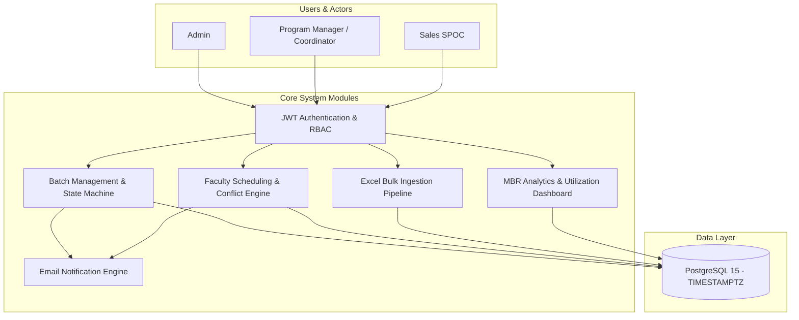
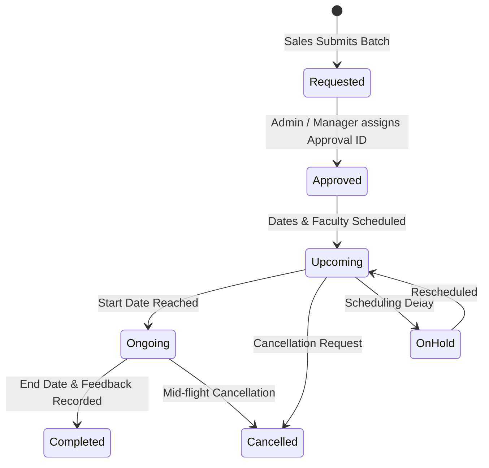
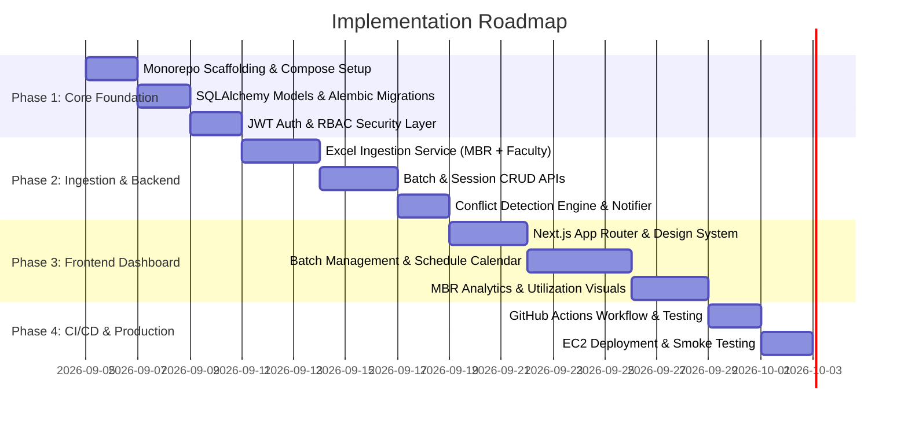

# Enterprise Operations & Faculty Utilization Platform
## Business Requirements Document (BRD) & Technical Architecture Specification

---

## 1. Executive Summary & Problem Context

### 1.1 Context & Background
The operations division orchestrates large-scale corporate upskilling, bootcamp delivery, and role-based technology training programs across major brands (**UNext**, **Prolearn**, and **Jigsaw**). The platform serves tier-1 enterprise clients including **Deloitte, DXC Technology, IBM, Capgemini, ICICI Bank, Fractal Analytics, Aditya Birla Group, Shell, and Societe Generale**.

### 1.2 Current Operational State & Pain Points
Analysis of existing operational files reveals severe operational bottlenecks caused by spreadsheet fragmentation:

1. **Massive Data Scale Managed via Excel**:
   - **`1.MBR_Active Batches.xlsx`**: Over **3,510 batch records** across multiple sheets (`Enrollment`, `Sheet1`, `Feedback`, `Cancelled`, `Summary`), with up to 145 heterogeneous columns.
   - **`Faculty_Utilisation - Ver 2.0.xlsx`**: Over **41,198 daily session rows** split across 15 coordinator sheets (e.g., *Pulikeshi, Deepak, Nitin, Shabaresh, Manjunath Reddy, Krishna Kumari Shetty, Priya Shetty, Anala*), manually copy-pasted into a 32MB Master ledger.
2. **Data Drift & Synchronization Errors**:
   - Program managers independently edit their local sheets, resulting in inconsistent naming conventions (e.g., `Swapna R` vs `Swapna`, `Online` vs `Remote`), broken formulas (`#VALUE!`), and date format mismatches (Excel serials vs string timestamps).
3. **Faculty Overlap & Conflict Blindspots**:
   - Lack of real-time validation leads to trainers being double-booked across different batches on the same date.
   - Disconnected visibility between **Internal Full-Time Faculty** (utilization targets) and **External Consultants / HOPs** (hourly billing costs).
4. **Manual Approval & Notification Cycles**:
   - Batch requests, SOW approvals (`Approval ID`), schedule changes, and cancellations are coordinated via emails and spreadsheets without audit trails or automated triggers.

### 1.3 Target State & Solution Objective
 Build a containerized **FastAPI + Next.js + PostgreSQL** monorepo orchestrated via **Docker** and deployed to **AWS EC2** via GitHub Actions. The platform will centralize batch lifecycles, automate daily session scheduling, provide intelligent Excel batch ingestion, prevent faculty double-booking, and deliver real-time MBR analytics.

---

## 2. Business Analysis of Datasets

### 2.1 Dataset 1: `1.MBR_Active Batches.xlsx` (Batch Operations & Lifecycle)

| Attribute Category | Field Names in Dataset | Business Meaning & System Mapping |
| :--- | :--- | :--- |
| **Identification** | `SL No.`, `Batch ID`, `Approval ID` | Unique identifiers for batch tracking and financial SOW linking. |
| **Organizational** | `Group/Entity`, `Vertical`, `Client`, `B2B/B2C` | Business unit (`UNext`, `Prolearn`), domain (`IT/ITES`, `DS/ITES`, `BFSI`), client account. |
| **Program Specs** | `Category`, `ProgramName`, `Technology`, `Domain` | Delivery format (`Bootcamp`, `RBT`, `PJP`, `Workshop`), curriculum, and tech stack. |
| **Logistics** | `Program Location`, `Mode (F2F/online/blended)`, `Venue` | Delivery mode (`Online`, `F2F`, `Blended`) and geographic center (`Bengaluru`, `Hyderabad`, etc.). |
| **Timeline** | `Start Date`, `End Date`, `Training days`, `Calender days` | Batch duration, active working days, and duration metrics. |
| **Enrollments** | `Total Enrollments`, `Resi. Enrollments`, `Enrolments` | Student headcount breakdown (Residential vs Non-Residential). |
| **Ownership** | `Program Manager`, `Sales SPOC`, `Spoc` | Operational coordinator and sales account owner. |
| **Quality & NPS** | `Batch Avg Feedback*`, `Total Feedback`, `Batch NPS*` | Aggregated student feedback score (1–5) and Net Promoter Score (-100 to 100). |
| **Status** | `Status`, `Program Status`, `Remarks` | State: `Upcoming`, `Ongoing`, `Completed`, `Cancelled`, `On Hold`. |

### 2.2 Dataset 2: `Faculty_Utilisation - Ver 2.0.xlsx` (Daily Session Ledger)

| Attribute | Dataset Values & Distribution | System Role |
| :--- | :--- | :--- |
| **Batch Reference** | `Batch ID` (links to MBR Batches) | Foreign key associating daily sessions to the parent batch. |
| **Session Date** | `Date of Training` | Enforced as `TIMESTAMPTZ (UTC)` to prevent timezone drift. |
| **Topic / Module** | `Topic` (e.g., *Replication to ABAP Systems*, *Spark Scala*) | Curriculum syllabus item being delivered. |
| **Faculty Info** | `Faculty Full Name`, `Internal/External` | Trainer assigned; mapped to centralized Faculty Directory. |
| **Faculty Type** | `External` (33k+ rows), `Internal Full time` (~5k rows), `HOP` | Distinguishes between salaried internal staff and contracted external vendors. |
| **Hours Delivered** | `NoofHours` (Standard slots: 8h, 4h, 2h, 2.5h, 1h) | Direct input for trainer payroll, billing, and capacity utilization. |
| **Session Rating** | `Module feedback` (Numeric: 1.0 to 5.0) | Granular quality evaluation at the module level. |
| **Delivery & Venue**| `Venue`, `Location /City`, `Mode of Delivery` | Physical or virtual classroom details. |
| **Coordinator** | `Coordinator` (*Poornima, Shabaresh, Pradeep, etc.*) | Operations manager supervising session execution. |

---

## 3. Core System Requirements & Use Cases



### 3.1 Role-Based Access Control (RBAC)
- **Admin**:
  - Full system administration, user role assignments.
  - Bulk ingestion of legacy `.xlsx` workbooks.
  - Financial, billing, and system-wide utilization analytics.
- **Program Manager / Coordinator**:
  - Create and manage assigned batches.
  - Schedule daily training sessions, assign faculty, record module feedback.
  - Resolve scheduling conflicts.
- **Sales SPOC**:
  - Submit batch requests, track client program progress.
  - Read-only access to assigned client schedules.

### 3.2 Batch Lifecycle State Machine
Batches progress through defined operational states:



- **Automated Email Triggers**:
  - Trigger email to Sales & Manager on `Approved`.
  - Trigger email alert to assigned Faculty on `Session Scheduled` / `Rescheduled`.
  - Trigger summary notification on `Cancelled` or `Completed`.

### 3.3 Faculty Scheduling & Real-Time Conflict Detection
When a user attempts to schedule a session:
1. System checks: `date_of_training`, `faculty_id`, and `no_of_hours`.
2. Validates if total allocated hours for that faculty on that date exceed daily capacity (e.g., > 8 hours) or overlap with existing sessions.
3. If a conflict is detected, returns a descriptive error with colliding Batch ID and details.

### 3.4 Smart Excel Ingestion Pipeline
- **Upload Endpoint**: Accepts multi-sheet `.xlsx` files (`1.MBR_Active Batches.xlsx` or `Faculty_Utilisation - Ver 2.0.xlsx`).
- **Processing Steps**:
  1. Auto-detect sheet format (Batch MBR format vs Faculty Session format).
  2. Normalize column headers and trim whitespace.
  3. Parse mixed date formats (Excel integer timestamps, standard ISO dates, strings).
  4. Perform atomic bulk upsert into PostgreSQL using SQLAlchemy.
  5. Return detailed ingestion report (rows processed, created, updated, errors).

---

## 4. Database Schema Specification (PostgreSQL)

> [!IMPORTANT]
> All timestamp columns use `TIMESTAMPTZ` with UTC timezone enforcement to eliminate scheduling drift across timezones.

```mermaid
erDiagram
    USERS ||--o{ BATCHES : "manages/requests"
    CLIENTS ||--o{ BATCHES : "orders"
    BATCHES ||--o{ TRAINING_SESSIONS : "contains"
    FACULTY ||--o{ TRAINING_SESSIONS : "conducts"
    BATCHES ||--o| BATCH_FEEDBACK : "evaluates"
    BATCHES ||--o{ AUDIT_LOGS : "tracks"

    USERS {
        uuid id PK
        string email UK
        string hashed_password
        string full_name
        string role "Admin, Manager, Sales"
        boolean is_active
        timestamptz created_at
    }

    CLIENTS {
        uuid id PK
        string name UK
        string code
        string primary_contact
        timestamptz created_at
    }

    FACULTY {
        uuid id PK
        string full_name UK
        string email
        string faculty_type "Internal Full-time, External Consultant, HOP"
        string domain "IT/ITES, DS/ITES, Cloud, BFSI"
        decimal standard_hourly_rate
        boolean is_active
    }

    BATCHES {
        uuid id PK
        string batch_id UK
        string approval_id
        uuid client_id FK
        string entity "UNext, Prolearn, Jigsaw"
        string vertical "IT/ITES, DS/ITES, BFSI"
        string category "Bootcamp, RBT, PJP, Workshop"
        string mode "Online, F2F, Blended"
        string program_name
        string technology
        timestamptz start_date
        timestamptz end_date
        int total_enrollments
        int residential_enrollments
        int training_days
        string status "Requested, Approved, Upcoming, Ongoing, Completed, Cancelled, OnHold"
        uuid manager_id FK
        uuid sales_spoc_id FK
        string venue_location
        decimal billing_amount
        text remarks
        timestamptz created_at
        timestamptz updated_at
    }

    TRAINING_SESSIONS {
        uuid id PK
        uuid batch_id FK
        timestamptz date_of_training
        string topic
        uuid faculty_id FK
        decimal no_of_hours
        decimal module_feedback
        string venue
        string location_city
        string mode_of_delivery
        string coordinator_name
        timestamptz created_at
    }

    BATCH_FEEDBACK {
        uuid id PK
        uuid batch_id FK UK
        decimal batch_avg_feedback
        decimal total_feedback_score
        decimal batch_nps
        int total_responses
        int promoters
        int detractors
        timestamptz recorded_at
    }

    AUDIT_LOGS {
        uuid id PK
        string entity_type
        uuid entity_id
        string action "CREATE, UPDATE, STATUS_CHANGE, DELETE"
        uuid performed_by FK
        jsonb metadata
        timestamptz timestamp
    }
```

---

## 5. REST API Architecture

### 5.1 Authentication & User Management
- `POST /api/v1/auth/login` - OAuth2 password flow, returns JWT access token.
- `GET /api/v1/auth/me` - Get current authenticated user profile and roles.
- `GET /api/v1/users` - List users (Admin only).
- `POST /api/v1/users` - Create user with specific role (Admin only).

### 5.2 Batch Operations
- `GET /api/v1/batches` - Paginated batch list with filters (`status`, `client_id`, `manager_id`, `date_range`, `vertical`).
- `POST /api/v1/batches` - Create new batch.
- `GET /api/v1/batches/{batch_id}` - Retrieve batch details, sessions, and metrics.
- `PATCH /api/v1/batches/{batch_id}` - Update batch metadata or state (`Approved`, `Cancelled`, etc.).
- `DELETE /api/v1/batches/{batch_id}` - Soft delete batch (Admin only).

### 5.3 Faculty & Scheduling Operations
- `GET /api/v1/faculty` - Faculty directory with search, type filter, and workload summary.
- `POST /api/v1/faculty` - Add new faculty profile.
- `GET /api/v1/sessions` - Query sessions with date range, faculty filter, and batch filter.
- `POST /api/v1/sessions` - Schedule session with automated conflict check.
- `PATCH /api/v1/sessions/{session_id}` - Update session, hours, or module feedback.
- `DELETE /api/v1/sessions/{session_id}` - Remove scheduled session.

### 5.4 Bulk Ingestion Engine
- `POST /api/v1/ingestion/batches` - Upload and parse MBR Active Batches Excel file.
- `POST /api/v1/ingestion/faculty-utilisation` - Upload and parse Faculty Utilisation Excel file.
- `GET /api/v1/ingestion/jobs/{job_id}` - Check asynchronous ingestion status and errors.

### 5.5 Analytics & Reporting
- `GET /api/v1/analytics/mbr-overview` - Summary cards (Total Batches, Active, Completed, Students Trained, Avg NPS).
- `GET /api/v1/analytics/faculty-utilization` - Hours delivered by Internal vs External, top faculty workload.
- `GET /api/v1/analytics/client-distribution` - Volume breakdown by client and vertical.

---

## 6. Monorepo Repository Structure

```
ops-project/
├── .github/
│   └── workflows/
│       └── deploy.yml              # CI/CD test and deploy pipeline
├── backend/
│   ├── app/
│   │   ├── api/
│   │   │   ├── v1/
│   │   │   │   ├── auth.py         # Login, JWT, User routes
│   │   │   │   ├── batches.py      # Batch CRUD and state transitions
│   │   │   │   ├── faculty.py      # Faculty management
│   │   │   │   ├── sessions.py     # Scheduling and conflict validation
│   │   │   │   ├── ingestion.py    # Excel parsing and bulk upload
│   │   │   │   └── analytics.py    # MBR and utilization metrics
│   │   │   └── deps.py             # Auth & RBAC dependencies
│   │   ├── core/
│   │   │   ├── config.py           # Pydantic Settings
│   │   │   ├── database.py         # SQLAlchemy engine & session factory
│   │   │   └── security.py         # Passlib hashing, JWT tokens
│   │   ├── models/                 # SQLAlchemy ORM models
│   │   │   ├── user.py
│   │   │   ├── client.py
│   │   │   ├── batch.py
│   │   │   ├── session.py
│   │   │   └── feedback.py
│   │   ├── schemas/                # Pydantic validation schemas
│   │   ├── services/
│   │   │   ├── excel_parser.py     # Openpyxl/Pandas batch ingestion service
│   │   │   ├── conflict_checker.py # Scheduling validation engine
│   │   │   └── notifier.py         # Background email dispatcher
│   │   └── main.py                 # FastAPI application factory
│   ├── alembic/                    # DB migration scripts
│   ├── tests/                      # Pytest test suite
 │   ├── Containerfile               # Docker backend specification
│   └── requirements.txt
├── frontend/
│   ├── src/
│   │   ├── app/                    # Next.js App Router
│   │   │   ├── (auth)/login/       # Sign-in page
│   │   │   ├── dashboard/          # MBR Executive Analytics
│   │   │   ├── batches/            # Batch management, detail, & create
│   │   │   ├── schedule/           # Daily session scheduler & calendar
│   │   │   ├── faculty/            # Faculty directory & utilization
│   │   │   └── ingestion/          # Excel upload & job monitor
│   │   ├── components/             # Reusable UI components
│   │   │   ├── ui/                 # Buttons, Cards, Inputs, Tables, Modals
│   │   │   ├── layout/             # Sidebar, Header, Navigation
│   │   │   └── charts/             # Utilization & Feedback charts
│   │   └── lib/                    # API client, Auth Context, Utilities
 │   ├── Containerfile               # Docker frontend specification
│   ├── package.json
│   └── next.config.js              # Standalone output configuration
├── .env.example                    # Environment template
 ├── docker-compose.yml              # Local development orchestration
 └── docker-compose.prod.yml         # Production EC2 orchestration
```

---

## 7. Container Orchestration & CI/CD Deployment

### 7.1 Local Development Orchestration (`docker-compose.yml`)
- **`db`**: PostgreSQL 15 Alpine on port `5432` with named volume `pgdata` and healthcheck.
- **`backend`**: FastAPI with hot-reloading (`--reload`) on port `8000`, bind-mounted to `./backend:/app`.
- **`frontend`**: Next.js development server on port `3000`, bind-mounted to `./frontend:/app`.

### 7.2 Production Orchestration (`docker-compose.prod.yml`)
- Multi-stage builds for minimal image size.
- Next.js running in `standalone` node mode.
- FastAPI running via production Gunicorn/Uvicorn workers.
- Automated `alembic upgrade head` on backend container initialization.

### 7.3 GitHub Actions CI/CD Pipeline
1. **Parallel Automated Tests**:
   - `test-backend`: Python 3.11 environment, executes `pytest backend/tests`.
   - `test-frontend`: Node 20 environment, executes `npm run lint` and `npm run build`.
2. **Automated SSH Deployment**:
   - On commit to `main`, connects to AWS EC2 instance via SSH secret keys.
   - Pulls latest code: `git pull origin main`.
 - Executes: `docker compose -f docker-compose.prod.yml up --build -d`.

---

## 8. Phased Implementation Roadmap


