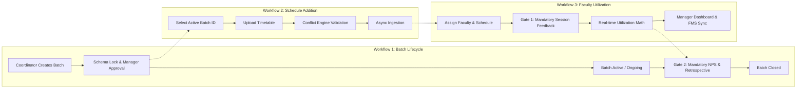
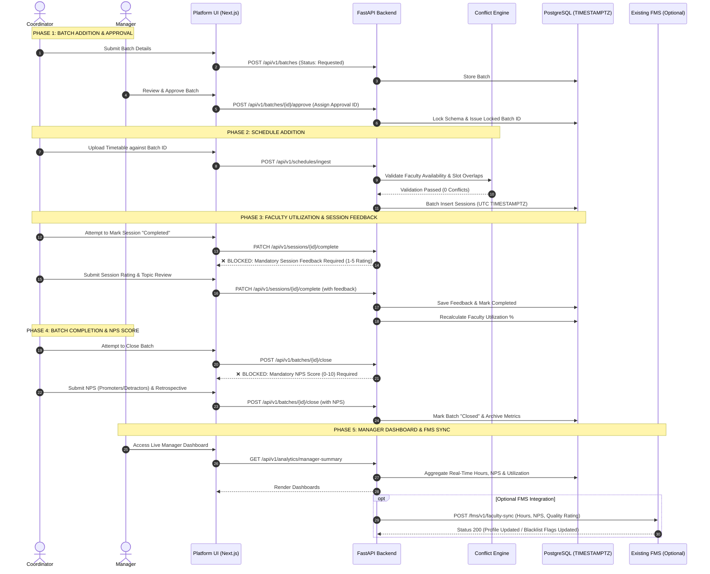

# Enterprise 3-Workflow Operations & Faculty Governance Platform
## Complete Technical Specification, DB Schema & Project Architecture

---

## 1. Executive Summary & 3-Workflow Model

The platform transitions operations from fragmented, ungoverned Excel spreadsheets into a unified **3-Workflow Enterprise Application** with strict schema locking, mandatory quality gates, real-time manager visibility, and optional Faculty Management System (FMS) synchronization.



---

## 2. End-to-End 5-Phase Lifecycle & Quality Gates

### 2.1 The 5 Operational Phases

| Phase | Workflow | Actors | Core Actions & System Governance |
| :--- | :--- | :--- | :--- |
| **Phase 1** | **Batch Addition & Approval** | Coordinator $\rightarrow$ Manager | Coordinator inputs batch details via structured forms or Excel parser. Schema is locked upon Manager approval and an immutable `Batch ID` is generated. |
| **Phase 2** | **Schedule Addition & Ingestion** | Coordinator $\rightarrow$ System | Timetable is uploaded against the locked `Batch ID`. Conflict engine checks faculty availability and slot collisions; sessions are ingested in the background. |
| **Phase 3** | **Faculty Utilization & Session Feedback** | Coordinator $\rightarrow$ System | Faculty delivers session. **Quality Checkpoint 1:** Marking session complete is **BLOCKED** until module feedback rating (1.0–5.0) and topic summary are submitted. |
| **Phase 4** | **Batch Completion & NPS Closure** | Coordinator $\rightarrow$ Manager | Batch completion is initiated. **Quality Checkpoint 2:** Closing batch is **BLOCKED** until final Batch NPS (0–10 score, promoters/detractors) and retrospective notes are submitted. |
| **Phase 5** | **Manager Dashboards & Optional FMS Sync** | Manager $\rightarrow$ FMS | Managers view real-time utilization, faculty quality scores, and batch health. APIs optionally sync session hours and ratings to external Faculty Management Systems. |

---

### 2.2 Sequence Flow Diagram



---

## 3. Role-Based Access Control (RBAC) & Scopes

The platform implements a **Flexible Shared-Coordinator and Co-Manager Model** to support operations where coordinators handle programs across multiple managers:

| Role | Scopes & Permissions |
| :--- | :--- |
| **Admin** | Full system administration, user provisioning, global rate/billing configs, FMS API keys, system-wide analytics, bulk legacy Excel ingestion. |
| **Manager** | Full CRUD on own and co-managed batches, approve batch creation requests, manage assigned coordinators, view scoped utilization and NPS analytics. |
| **Co-Manager** | Shared visibility and approval rights on batches co-owned across verticals (e.g. IT/ITES + DS/ITES). |
| **Coordinator** | Create batches, upload timetables, assign faculty, submit session feedback (Checkpoint 1), and submit batch NPS (Checkpoint 2). Can be linked to multiple managers. |
| **Sales SPOC** | Submit new batch requests, view real-time status and delivery timeline for assigned client accounts (read-only on sessions/feedback). |
| **Faculty (Read-Only)** | View personal assigned training schedule, venues, topics, and student headcount. |

---

## 4. Comprehensive PostgreSQL Database Schema

```mermaid
erDiagram
    USERS ||--o{ USER_MANAGER_MAPPING : "has coordinator"
    USERS ||--o{ BATCH_CO_MANAGERS : "co-manages"
    USERS ||--o{ BATCHES : "manages/creates"
    CLIENTS ||--o{ BATCHES : "sponsors"
    BATCHES ||--o{ TRAINING_SESSIONS : "consists of"
    FACULTY ||--o{ TRAINING_SESSIONS : "conducts"
    BATCHES ||--o| BATCH_NPS_CLOSURE : "closes with"
    TRAINING_SESSIONS ||--o| SESSION_FEEDBACK : "evaluated by"
    FACULTY ||--o{ FACULTY_FMS_SYNC_LOGS : "syncs to"

    USERS {
        uuid id PK
        string email UK
        string hashed_password
        string full_name
        string role "Admin, Manager, Coordinator, Sales, Faculty"
        boolean is_active
        timestamptz created_at
    }

    USER_MANAGER_MAPPING {
        uuid id PK
        uuid coordinator_id FK
        uuid manager_id FK
        timestamptz assigned_at
    }

    CLIENTS {
        uuid id PK
        string name UK
        string code
        string vertical "IT/ITES, DS/ITES, BFSI, Retail"
        string primary_contact_email
        timestamptz created_at
    }

    FACULTY {
        uuid id PK
        string full_name
        string email
        string phone
        string faculty_type "Internal Full-time, External Consultant, HOP"
        string domain "IT/ITES, Cloud, DS/ML, CyberSecurity, FullStack"
        string fms_external_id UK
        string fms_status "Active, Flagged, Blocked"
        decimal standard_hourly_rate
        boolean is_active
        timestamptz created_at
    }

    BATCHES {
        uuid id PK
        string batch_id UK "Immutable locked ID e.g. DTA_PysparkScala_SOW56_ILT_B2"
        string approval_id "Financial SOW Reference"
        uuid client_id FK
        string entity "UNext, Prolearn, Jigsaw"
        string vertical "IT/ITES, DS/ITES, BFSI"
        string category "Bootcamp, RBT, PJP, Workshop"
        string program_name
        string technology
        string delivery_mode "Online, F2F, Blended"
        string location_city "Bengaluru, Hyderabad, Mumbai, Remote"
        timestamptz start_date
        timestamptz end_date
        int total_enrollments
        int residential_enrollments
        int training_days
        string status "Requested, Approved, Upcoming, Ongoing, Completed, Cancelled, OnHold"
        uuid primary_manager_id FK
        uuid coordinator_id FK
        uuid sales_spoc_id FK
        decimal billing_amount
        boolean is_schema_locked
        timestamptz created_at
        timestamptz updated_at
    }

    BATCH_CO_MANAGERS {
        uuid id PK
        uuid batch_id FK
        uuid manager_id FK
        timestamptz added_at
    }

    TRAINING_SESSIONS {
        uuid id PK
        uuid batch_id FK
        timestamptz date_of_training "UTC Timestamp"
        time start_time
        time end_time
        string topic
        uuid faculty_id FK
        decimal no_of_hours "e.g. 8.0, 4.0, 2.0"
        string venue
        string location_city
        string mode_of_delivery "Online, Offline, F2F"
        string status "Scheduled, InProgress, Completed, Cancelled, Rescheduled"
        boolean feedback_submitted "Check 1 Gate"
        timestamptz created_at
    }

    SESSION_FEEDBACK {
        uuid id PK
        uuid session_id FK UK
        decimal rating "1.0 to 5.0"
        text topic_feedback
        text faculty_observations
        int total_students_present
        timestamptz submitted_at
        uuid submitted_by FK
    }

    BATCH_NPS_CLOSURE {
        uuid id PK
        uuid batch_id FK UK
        decimal nps_score "0 to 10"
        decimal net_promoter_index "-100 to 100"
        int total_responses
        int promoters_count
        int passive_count
        int detractors_count
        decimal average_feedback_score "1.0 to 5.0"
        text retrospective_notes
        text client_feedback
        timestamptz closed_at
        uuid closed_by FK
    }

    FACULTY_FMS_SYNC_LOGS {
        uuid id PK
        uuid faculty_id FK
        string sync_event "HOURS_UPDATE, RATING_SYNC, APPRAISAL_PUSH"
        jsonb payload
        string status "SUCCESS, FAILED, PENDING"
        timestamptz timestamp
    }
```

---

## 5. REST API Endpoint Specifications

### 5.1 Auth & User Hierarchy
| Method | Endpoint | Description | Access Scope |
| :--- | :--- | :--- | :--- |
| `POST` | `/api/v1/auth/login` | Issues JWT bearer token with user role and coordinator/manager mapping | Public |
| `GET` | `/api/v1/auth/me` | Fetches current user profile, assigned managers/coordinators | Authenticated |
| `GET` | `/api/v1/users/coordinators` | List coordinators mapped to current manager | Manager, Admin |
| `POST` | `/api/v1/users/coordinator-mapping` | Assign coordinator to manager(s) | Admin, Manager |

### 5.2 Workflow 1: Batch Lifecycle & Checkpoint 2
| Method | Endpoint | Description | Access Scope |
| :--- | :--- | :--- | :--- |
| `POST` | `/api/v1/batches` | Create new batch in `Requested` status | Coordinator, Sales, Manager |
| `POST` | `/api/v1/batches/{id}/approve` | Assign `Approval ID`, lock schema, set status `Approved` | Manager, Admin |
| `GET` | `/api/v1/batches` | Filtered batches (by manager, status, vertical, client) | Authenticated |
| `GET` | `/api/v1/batches/{id}` | Batch detail with sessions, feedback, and closure status | Authenticated |
| `POST` | `/api/v1/batches/{id}/close` | **Gate 2:** Submits NPS + Retrospective; closes batch | Coordinator, Manager |

### 5.3 Workflow 2: Schedule Ingestion & Conflict Engine
| Method | Endpoint | Description | Access Scope |
| :--- | :--- | :--- | :--- |
| `POST` | `/api/v1/schedules/validate` | Dry-run slot overlap & faculty capacity check | Coordinator, Manager |
| `POST` | `/api/v1/schedules/ingest` | Ingest timetable Excel/CSV against locked `Batch ID` | Coordinator, Manager |
| `GET` | `/api/v1/schedules/conflicts` | List unresolved faculty scheduling collisions | Manager, Admin |

### 5.4 Workflow 3: Faculty Utilization & Checkpoint 1
| Method | Endpoint | Description | Access Scope |
| :--- | :--- | :--- | :--- |
| `GET` | `/api/v1/sessions` | Calendar/Ledger query with date filters & faculty ID | Authenticated |
| `POST` | `/api/v1/sessions` | Schedule single session with conflict check | Coordinator, Manager |
| `PATCH` | `/api/v1/sessions/{id}/complete` | **Gate 1:** Submits module rating (1-5) and marks complete | Coordinator, Manager |
| `GET` | `/api/v1/faculty/utilization` | Utilization breakdown (Internal vs External, Hours) | Manager, Admin |

### 5.5 Optional FMS Integration & Analytics
| Method | Endpoint | Description | Access Scope |
| :--- | :--- | :--- | :--- |
| `POST` | `/api/v1/integrations/fms/sync` | Pushes hours & feedback ratings to external FMS | Admin |
| `GET` | `/api/v1/analytics/manager-dashboard` | Scoped manager KPI cards (Hours, Active Batches, NPS) | Manager, Admin |
| `GET` | `/api/v1/analytics/mbr-export` | Generates standardized MBR Excel report | Manager, Admin |

---

## 6. Monorepo Repository Structure

```
ops-project/
├── .github/
│   └── workflows/
│       └── deploy.yml                  # GitHub Actions CI/CD Pipeline
├── backend/
│   ├── app/
│   │   ├── api/
│   │   │   ├── v1/
│   │   │   │   ├── auth.py             # Auth & user mappings
│   │   │   │   ├── batches.py          # Workflow 1 (Creation, Approval, Closure Gate)
│   │   │   │   ├── schedules.py        # Workflow 2 (Ingestion & Timetables)
│   │   │   │   ├── sessions.py         # Workflow 3 (Session complete Gate)
│   │   │   │   ├── faculty.py          # Faculty directory & FMS status
│   │   │   │   ├── fms_sync.py         # Optional FMS integration dispatcher
│   │   │   │   └── analytics.py        # Real-time manager dashboards
│   │   │   └── deps.py                 # RBAC & token injection
│   │   ├── core/
│   │   │   ├── config.py               # Settings & Environment variables
│   │   │   ├── database.py             # PostgreSQL session maker & engine
│   │   │   └── security.py             # JWT & Password hashing
│   │   ├── models/                     # SQLAlchemy Models (TIMESTAMPTZ)
│   │   │   ├── user.py
│   │   │   ├── client.py
│   │   │   ├── faculty.py
│   │   │   ├── batch.py
│   │   │   ├── session.py
│   │   │   └── feedback.py
│   │   ├── schemas/                    # Pydantic input/output schemas
│   │   ├── services/
│   │   │   ├── conflict_engine.py      # Real-time faculty double-booking detection
│   │   │   ├── excel_ingestion.py      # Multi-format Excel parser & schema validator
│   │   │   ├── gatekeeper.py           # Gate 1 & Gate 2 mandatory checkpoint guards
│   │   │   └── notifier.py             # Async email notifications
│   │   └── main.py                     # FastAPI entrypoint
│   ├── alembic/                        # Database migration scripts
│   ├── tests/                          # Backend test suite (pytest)
 │   ├── Containerfile                   # Docker backend image specification
│   └── requirements.txt
├── frontend/
│   ├── src/
│   │   ├── app/                        # Next.js App Router
│   │   │   ├── (auth)/login/page.tsx   # Login page
│   │   │   ├── dashboard/page.tsx      # Real-time Manager Dashboard
│   │   │   ├── batches/                # Workflow 1 UI
│   │   │   │   ├── page.tsx            # Batch listing & status filters
│   │   │   │   ├── new/page.tsx        # Create batch form
│   │   │   │   └── [id]/page.tsx       # Batch detail & Closure Modal (Gate 2)
│   │   │   ├── schedule/               # Workflow 2 UI
│   │   │   │   ├── page.tsx            # Master calendar / daily ledger
│   │   │   │   └── upload/page.tsx     # Timetable drag-and-drop ingestion
│   │   │   ├── faculty/                # Workflow 3 UI
│   │   │   │   ├── page.tsx            # Faculty directory & utilization stats
│   │   │   │   └── [id]/page.tsx       # Faculty profile, workload & FMS sync logs
│   │   │   └── settings/page.tsx       # User mappings & FMS API configuration
│   │   ├── components/
│   │   │   ├── ui/                     # Form controls, Modals, Badges, Tables
│   │   │   ├── gates/                  # SessionFeedbackGateModal, BatchNpsGateModal
│   │   │   ├── schedule/               # ConflictAlertBanner, CalendarGrid
│   │   │   └── analytics/              # UtilizationChart, NpsGaugeChart
│   │   └── lib/
│   │       ├── api.ts                  # Axios/Fetch client with JWT interceptor
│   │       └── auth-context.tsx        # Role and coordinator scope provider
 │   ├── Containerfile                   # Docker frontend image specification
│   ├── package.json
│   └── next.config.js                  # Standalone output configuration
├── .env.example
 ├── docker-compose.yml                  # Local development orchestration
 └── docker-compose.prod.yml             # Production EC2 orchestration
```

---

## 7. Container Orchestration & CI/CD Blueprint

### 7.1 Local Development (`docker-compose.yml`)
```yaml
version: '3.8'

services:
  db:
    image: docker.io/library/postgres:15-alpine
    container_name: app_db
    environment:
      POSTGRES_USER: ${POSTGRES_USER:-postgres}
      POSTGRES_PASSWORD: ${POSTGRES_PASSWORD:-postgres}
      POSTGRES_DB: ${POSTGRES_DB:-ops_db}
    ports:
      - "5432:5432"
    volumes:
      - pgdata:/var/lib/postgresql/data
    healthcheck:
      test: ["CMD-SHELL", "pg_isready -U postgres -d ops_db"]
      interval: 5s
      timeout: 5s
      retries: 5

  backend:
    build:
      context: ./backend
      dockerfile: Containerfile
    container_name: app_backend
    command: uvicorn app.main:app --host 0.0.0.0 --port 8000 --reload
    ports:
      - "8000:8000"
    volumes:
      - ./backend:/app
    environment:
      - DATABASE_URL=postgresql://${POSTGRES_USER:-postgres}:${POSTGRES_PASSWORD:-postgres}@db:5432/${POSTGRES_DB:-ops_db}
      - JWT_SECRET=${JWT_SECRET:-dev_secret_key_12345}
    depends_on:
      db:
        condition: service_healthy

  frontend:
    build:
      context: ./frontend
      dockerfile: Containerfile
      args:
        NEXT_PUBLIC_API_URL: http://localhost:8000
    container_name: app_frontend
    ports:
      - "3000:3000"
    volumes:
      - ./frontend:/app
      - /app/node_modules
    depends_on:
      - backend

volumes:
  pgdata:
```

### 7.2 GitHub Actions CI/CD Pipeline (`.github/workflows/deploy.yml`)
```yaml
name: CI/CD Pipeline

on:
  push:
    branches: [ "main" ]

jobs:
  test-backend:
    runs-on: ubuntu-latest
    steps:
      - uses: actions/checkout@v4
      - uses: actions/setup-python@v5
        with:
          python-version: '3.11'
      - name: Install Dependencies
        run: |
          pip install -r backend/requirements.txt
      - name: Run Backend Pytest
        run: |
          pytest backend/tests

  test-frontend:
    runs-on: ubuntu-latest
    steps:
      - uses: actions/checkout@v4
      - uses: actions/setup-node@v4
        with:
          node-version: '20'
      - name: Install & Build Frontend
        run: |
          cd frontend
          npm ci
          npm run lint
          npm run build

  deploy:
    needs: [test-backend, test-frontend]
    runs-on: ubuntu-latest
    if: github.ref == 'refs/heads/main'
    steps:
      - uses: actions/checkout@v4
      - name: Deploy to AWS EC2 via SSH
        uses: appleboy/ssh-action@v1.0.3
        with:
          host: ${{ secrets.EC2_HOST }}
          username: ${{ secrets.EC2_USERNAME }}
          key: ${{ secrets.EC2_SSH_KEY }}
          script: |
            cd /home/ubuntu/app
            git pull origin main
            docker compose -f docker-compose.prod.yml up --build -d
            docker exec app_backend alembic upgrade head
```
