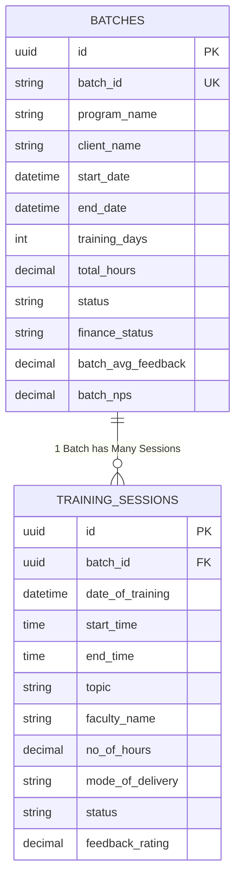
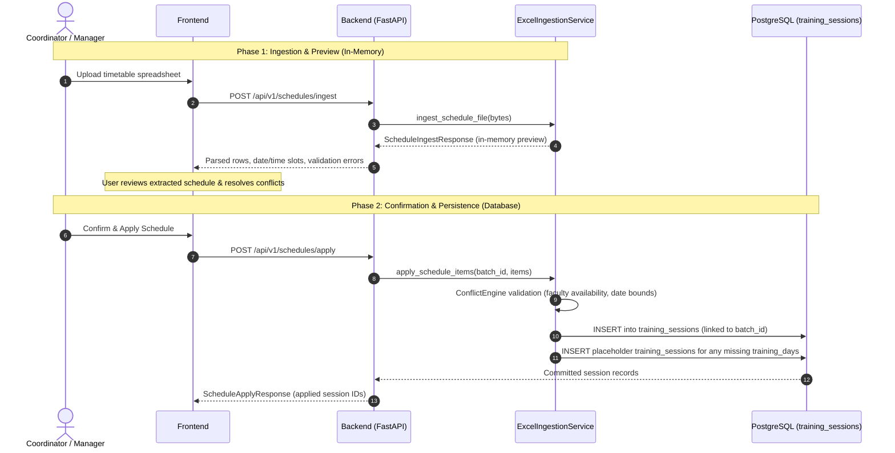

# Operations Management System (Ops)

An enterprise operations platform for managing corporate training batches, training schedules, faculty allocations, financial milestone tracking, and quality feedback.

---

## Architecture Overview

* **Frontend**: Next.js (TypeScript, React)
* **Backend**: FastAPI (Python 3.12, SQLAlchemy, Pydantic v2)
* **Database**: PostgreSQL with Alembic migrations
* **Containerization**: Docker Compose (`db`, `backend`, `frontend`)

---

## Core Data Architecture: `batches` vs. `training_sessions`

In this system, `batches` and `training_sessions` form a **parent–child (one-to-many)** relationship representing two distinct operational layers:



### Key Differences

| Feature / Dimension | `batches` (Parent) | `training_sessions` (Child) |
| :--- | :--- | :--- |
| **Concept & Scope** | **Macro-level program / contract engagement**. Tracks the overarching training program across its full lifecycle. | **Micro-level delivery unit**. Represents an individual day/time block of training. |
| **Cardinality** | 1 batch has many sessions (`cascade="all, delete-orphan"`). | Belongs to 1 batch via `batch_id` foreign key. |
| **Time Granularity** | Macro timeline (`start_date`, `end_date`, `batch_request_date`, `training_days`, cumulative `total_hours`). | Micro timeline (`date_of_training`, `start_time`, `end_time`, `no_of_hours`). |
| **Topic & Syllabus** | Program name, technology stack, and domain categorization. | Daily granular module / topic taught. |
| **Personnel Roles** | Governance & ownership: `primary_manager_id`, `coordinator_id`, `sales_spoc_id`, and tier approvers. | Operational delivery: `faculty_name` assigned for that specific session. |
| **Status & Lifecycle** | Governance state: `Requested`, `Approved`, `Upcoming`, `Ongoing`, `Completed`, `Cancelled`, `OnHold`. | Execution state: `Scheduled`, `InProgress`, `Completed`, `Cancelled`, `Rescheduled`. |
| **Quality & Feedback** | Program-level aggregated quality: `batch_avg_feedback`, overall `batch_nps`, promoters/passives/detractors counts. | Day-level quality: `feedback_submitted`, `feedback_rating` (1–5), and `feedback_notes`. |
| **Commercials & SOW** | Financial contract: `sow_number`, `approval_id`, `finance_status` (`Pending`, `Cleared`), `finance_status_check_date`. | None (financials are exclusively managed at the batch level). |

---

## Schedule Ingestion & Storage Lifecycle

When training timetables (Excel `.xlsx`, `.xls`, or `.csv`) are ingested, the system processes them in a **two-phase pipeline (Preview $\rightarrow$ Persist)**:



### Where is the ingested data stored?

1. **Raw File**:
   * The uploaded Excel/CSV file is processed directly **in memory** via Pandas. The raw spreadsheet file is **not stored** on disk or in the database.
2. **Phase 1: Ingestion (`POST /api/v1/schedules/ingest`)**:
   * **Stored in-memory only**. It does **not** modify or write to the database.
   * Performs column aliasing, header detection, date/time parsing, and returns an extracted schedule preview (`ScheduleIngestResponse`) for the user to review.
3. **Phase 2: Application (`POST /api/v1/schedules/apply`)**:
   * **Stored in the PostgreSQL `training_sessions` table**.
   * Validates dates against `batch.start_date` and `batch.end_date`, checks for duplicate sessions, and verifies faculty capacity via `ConflictEngine`.
   * Inserts individual records into `training_sessions` mapped to the parent `batch_id`.
   * If the batch requires more `training_days` than defined in the schedule, the system automatically creates placeholder sessions marked as `"Generated training day - details required"`.

---

## Quickstart Guide

### 1. Start Services

```powershell
docker compose up -d
```

### 2. Apply Database Migrations

```powershell
docker compose exec backend alembic upgrade head
```

### 3. Initialize Teams and Default Users

```powershell
# Populate default teams (Delivery, Sales, Finance)
docker compose exec backend python scripts/seed_teams.py

# Populate default user hierarchy
$env:DEFAULT_USER_PASSWORD = "use-a-secure-temporary-password"
docker compose exec -e DEFAULT_USER_PASSWORD=$env:DEFAULT_USER_PASSWORD backend python scripts/seed_default_users.py
Remove-Item Env:DEFAULT_USER_PASSWORD

# Create an administrator
docker compose exec backend python scripts/create_admin.py --email admin@enterprise-ops.com
```

For more details on backend configuration and migrations, see [backend/README.md](file:///d:/projects%20and%20files/ops/backend/README.md).
