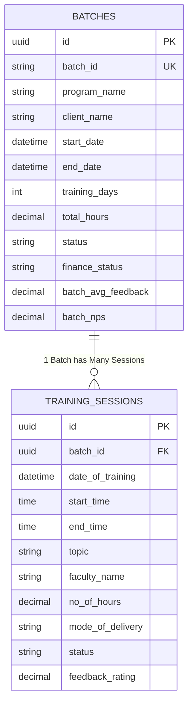
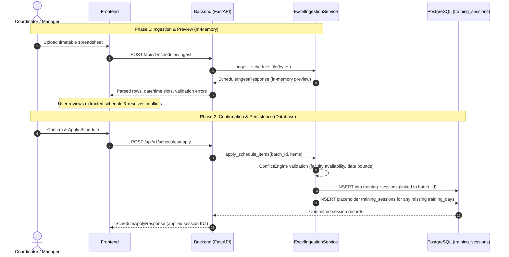

# Operations Management System (Ops)

An enterprise operations platform for managing corporate training batches, training schedules, faculty allocations, financial milestone tracking, and quality feedback.

---

## Architecture Overview

* **Frontend**: Next.js (TypeScript, React)
* **Backend**: FastAPI (Python 3.12, SQLAlchemy, Pydantic v2)
* **Database**: PostgreSQL with Alembic migrations
* **Containerization**: Docker Compose (`db`, `backend`, `frontend`)

---

## Core Data Architecture: `batches` vs. `training_sessions`

In this system, `batches` and `training_sessions` form a **parent–child (one-to-many)** relationship representing two distinct operational layers:


```mermaid
erDiagram
    BATCHES ||--o{ TRAINING_SESSIONS : "1 Batch has Many Sessions"
    BATCHES {
        uuid id PK
        string batch_id UK
        string program_name
        string client_name
        datetime start_date
        datetime end_date
        int training_days
        decimal total_hours
        string status
        string finance_status
        decimal batch_avg_feedback
        decimal batch_nps
    }
    TRAINING_SESSIONS {
        uuid id PK
        uuid batch_id FK
        datetime date_of_training
        time start_time
        time end_time
        string topic
        string faculty_name
        decimal no_of_hours
        string mode_of_delivery
        string status
        decimal feedback_rating
    }
```

### Key Differences

| Feature / Dimension | `batches` (Parent) | `training_sessions` (Child) |
| :--- | :--- | :--- |
| **Concept & Scope** | **Macro-level program / contract engagement**. Tracks the overarching training program across its full lifecycle. | **Micro-level delivery unit**. Represents an individual day/time block of training. |
| **Cardinality** | 1 batch has many sessions (`cascade="all, delete-orphan"`). | Belongs to 1 batch via `batch_id` foreign key. |
| **Time Granularity** | Macro timeline (`start_date`, `end_date`, `batch_request_date`, `training_days`, cumulative `total_hours`). | Micro timeline (`date_of_training`, `start_time`, `end_time`, `no_of_hours`). |
| **Topic & Syllabus** | Program name, technology stack, and domain categorization. | Daily granular module / topic taught. |
| **Personnel Roles** | Governance & ownership: `primary_manager_id`, `coordinator_id`, `sales_spoc_id`, and tier approvers. | Operational delivery: `faculty_name` assigned for that specific session. |
| **Status & Lifecycle** | Governance state: `Requested`, `Approved`, `Upcoming`, `Ongoing`, `Completed`, `Cancelled`, `OnHold`. | Execution state: `Scheduled`, `InProgress`, `Completed`, `Cancelled`, `Rescheduled`. |
| **Quality & Feedback** | Program-level aggregated quality: `batch_avg_feedback`, overall `batch_nps`, promoters/passives/detractors counts. | Day-level quality: `feedback_submitted`, `feedback_rating` (1–5), and `feedback_notes`. |
| **Commercials & SOW** | Financial contract: `sow_number`, `approval_id`, `finance_status` (`Pending`, `Cleared`), `finance_status_check_date`. | None (financials are exclusively managed at the batch level). |

---

## Schedule Ingestion & Storage Lifecycle

When training timetables (Excel `.xlsx`, `.xls`, or `.csv`) are ingested, the system processes them in a **two-phase pipeline (Preview $\rightarrow$ Persist)**:


```mermaid
sequenceDiagram
    autonumber
    actor User as Coordinator / Manager
    participant Client as Frontend
    participant API as Backend (FastAPI)
    participant Service as ExcelIngestionService
    participant DB as PostgreSQL (training_sessions)

    Note over User,Service: Phase 1: Ingestion & Preview (In-Memory)
    User->>Client: Upload timetable spreadsheet
    Client->>API: POST /api/v1/schedules/ingest
    API->>Service: ingest_schedule_file(bytes)
    Service-->>API: ScheduleIngestResponse (in-memory preview)
    API-->>Client: Parsed rows, date/time slots, validation errors
    Note over Client: User reviews extracted schedule & resolves conflicts

    Note over User,DB: Phase 2: Confirmation & Persistence (Database)
    User->>Client: Confirm & Apply Schedule
    Client->>API: POST /api/v1/schedules/apply
    API->>Service: apply_schedule_items(batch_id, items)
    Service->>Service: ConflictEngine validation (faculty availability, date bounds)
    Service->>DB: INSERT into training_sessions (linked to batch_id)
    Service->>DB: INSERT placeholder training_sessions for any missing training_days
    DB-->>API: Committed session records
    API-->>Client: ScheduleApplyResponse (applied session IDs)
```

### Where is the ingested data stored?

1. **Raw File**:
   * The uploaded Excel/CSV file is processed directly **in memory** via Pandas. The raw spreadsheet file is **not stored** on disk or in the database.
2. **Phase 1: Ingestion (`POST /api/v1/schedules/ingest`)**:
   * **Stored in-memory only**. It does **not** modify or write to the database.
   * Performs column aliasing, header detection, date/time parsing, and returns an extracted schedule preview (`ScheduleIngestResponse`) for the user to review.
3. **Phase 2: Application (`POST /api/v1/schedules/apply`)**:
   * **Stored in the PostgreSQL `training_sessions` table**.
   * Validates dates against `batch.start_date` and `batch.end_date`, checks for duplicate sessions, and verifies faculty capacity via `ConflictEngine`.
   * Inserts individual records into `training_sessions` mapped to the parent `batch_id`.
   * If the batch requires more `training_days` than defined in the schedule, the system automatically creates placeholder sessions marked as `"Generated training day - details required"`.

---

## Quickstart Guide

### 1. Start Services

```powershell
docker compose up -d
```

### 2. Apply Database Migrations

```powershell
docker compose exec backend alembic upgrade head
```

### 3. Initialize Teams and Default Users

```powershell
# Populate default teams (Delivery, Sales, Finance)
docker compose exec backend python scripts/seed_teams.py

# Populate default user hierarchy
$env:DEFAULT_USER_PASSWORD = "use-a-secure-temporary-password"
docker compose exec -e DEFAULT_USER_PASSWORD=$env:DEFAULT_USER_PASSWORD backend python scripts/seed_default_users.py
Remove-Item Env:DEFAULT_USER_PASSWORD

# Create an administrator
docker compose exec backend python scripts/create_admin.py --email admin@enterprise-ops.com
```

For more details on backend configuration and migrations, see [backend/README.md](file:///d:/projects%20and%20files/ops/backend/README.md).

---

## Frontend Development & Hot Reload

The default stack above is a **production** frontend: `Containerfile` runs `next build` and the container serves a pre-compiled standalone bundle via `node server.js`. That server has no compiler, no file watcher, and no HMR socket, and the compose service mounts no source, so edits to `frontend/` are invisible until the image is rebuilt.

Hot reload requires the Next.js dev server (`next dev`), which enables React Fast Refresh by default. Two supported ways to run it:

### Option A: dev server on the host (recommended)

Fastest and avoids Docker Desktop's bind-mount filesystem layer entirely.

```powershell
docker compose up -d db backend

cd frontend
npm install
npm run dev
```

Open `http://localhost:3000`. Save any file under `frontend/app` or `frontend/components` and the browser updates in place.

`frontend/.env.development` supplies `NEXT_PUBLIC_API_URL`. Note that Next reads `.env*` from `frontend/`, not the repository root, and that `NEXT_PUBLIC_*` values are inlined at compile time — editing them requires a dev server restart.

### Option B: dev server in Docker

```powershell
docker compose --profile dev up --build frontend-dev
```

`frontend/Containerfile.dev` runs `next dev` against the working tree bind-mounted at `/app`. Two details make this reliable rather than merely functional:

* **`node_modules` and `.next` are named volumes.** The host tree is Windows and contains win32-native binaries, which would otherwise shadow the container's Linux dependencies. Keeping `.next` on the container filesystem is also far faster than writing build output through the Docker Desktop mount.
* **`WATCHPACK_POLLING` defaults to `true`.** Docker Desktop's bind-mount layer does not deliver filesystem events into the container, so without polling the watcher never fires and edits appear to save without taking effect. Next 14 watches through webpack's watchpack rather than chokidar, so this is the only knob required. On a Linux host, or when running the dev server natively, set `FRONTEND_WATCH_POLLING=false` in `.env` to drop the polling CPU cost.

`frontend-dev` shares host port 3000 with the production `frontend` service and lives behind the `dev` profile, so `docker compose up` is unaffected. Start only one of them, or point the dev server elsewhere:

```powershell
$env:FRONTEND_DEV_PORT = "3001"
docker compose --profile dev up --build frontend-dev
```

### Verifying hot reload is actually live

A running dev server logs on every change. If edits save but nothing recompiles, the server is a production build — confirm you are on `next dev`, not `next start`, and that the process logs `ready` rather than serving from `.next/standalone`.

### After changing dependencies

The `frontend_dev_node_modules` volume is seeded from the image the first time it runs and is not refreshed afterwards, so a newly added or updated package stays invisible to the container. Rebuild and reset it:

```powershell
docker compose --profile dev down -v
docker compose --profile dev up --build frontend-dev
```

This also discards the cached `.next` volume, so the first compile after it is slow.

