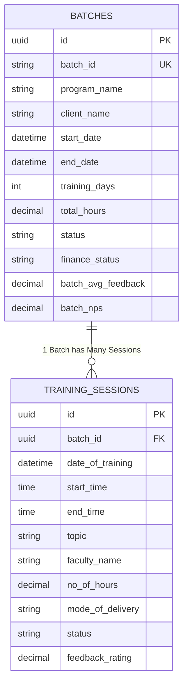

# Operations Management System (Ops)

An enterprise operations platform for managing corporate training batches, training schedules, faculty allocations, financial milestone tracking, and quality feedback.

---

## Architecture Overview

* **Frontend**: Next.js (TypeScript, React)
* **Backend**: FastAPI (Python 3.12, SQLAlchemy, Pydantic v2)
* **Database**: PostgreSQL with Alembic migrations
* **Containerization**: Docker Compose (`db`, `backend`, `frontend`)

---

## Core Data Architecture: `batches` vs. `training_sessions`

In this system, `batches` and `training_sessions` form a **parent–child (one-to-many)** relationship representing two distinct operational layers:


```mermaid
erDiagram
    BATCHES ||--o{ TRAINING_SESSIONS : "1 Batch has Many Sessions"
    BATCHES {
        uuid id PK
        string batch_id UK
        string program_name
        string client_name
        datetime start_date
        datetime end_date
        int training_days
        decimal total_hours
        string status
        string finance_status
        decimal batch_avg_feedback
        decimal batch_nps
    }
    TRAINING_SESSIONS {
        uuid id PK
        uuid batch_id FK
        datetime date_of_training
        time start_time
        time end_time
        string topic
        string faculty_name
        decimal no_of_hours
        string mode_of_delivery
        string status
        decimal feedback_rating
    }
```

### Key Differences

| Feature / Dimension | `batches` (Parent) | `training_sessions` (Child) |
| :--- | :--- | :--- |
| **Concept & Scope** | **Macro-level program / contract engagement**. Tracks the overarching training program across its full lifecycle. | **Micro-level delivery unit**. Represents an individual day/time block of training. |
| **Cardinality** | 1 batch has many sessions (`cascade="all, delete-orphan"`). | Belongs to 1 batch via `batch_id` foreign key. |
| **Time Granularity** | Macro timeline (`start_date`, `end_date`, `batch_request_date`, `training_days`, cumulative `total_hours`). | Micro timeline (`date_of_training`, `start_time`, `end_time`, `no_of_hours`). |
| **Topic & Syllabus** | Program name, technology stack, and domain categorization. | Daily granular module / topic taught. |
| **Personnel Roles** | Governance & ownership: `primary_manager_id`, `coordinator_id`, `sales_spoc_id`, and tier approvers. | Operational delivery: `faculty_name` assigned for that specific session. |
| **Status & Lifecycle** | Governance state: `Requested`, `Approved`, `Upcoming`, `Ongoing`, `Completed`, `Cancelled`, `OnHold`. | Execution state: `Scheduled`, `InProgress`, `Completed`, `Cancelled`, `Rescheduled`. |
| **Quality & Feedback** | Program-level aggregated quality: `batch_avg_feedback`, overall `batch_nps`, promoters/passives/detractors counts. | Day-level quality: `feedback_submitted`, `feedback_rating` (1–5), and `feedback_notes`. |
| **Commercials & SOW** | Financial contract: `sow_number`, `approval_id`, `finance_status` (`Pending`, `Cleared`), `finance_status_check_date`. | None (financials are exclusively managed at the batch level). |

---

## Schedule Ingestion & Storage Lifecycle

When training timetables (Excel `.xlsx`, `.xls`, or `.csv`) are ingested, the system processes them in a **two-phase pipeline (Preview $\rightarrow$ Persist)**:


```mermaid
sequenceDiagram
    autonumber
    actor User as Coordinator / Manager
    participant Client as Frontend
    participant API as Backend (FastAPI)
    participant Service as ExcelIngestionService
    participant DB as PostgreSQL (training_sessions)

    Note over User,Service: Phase 1: Ingestion & Preview (In-Memory)
    User->>Client: Upload timetable spreadsheet
    Client->>API: POST /api/v1/schedules/ingest
    API->>Service: ingest_schedule_file(bytes)
    Service-->>API: ScheduleIngestResponse (in-memory preview)
    API-->>Client: Parsed rows, date/time slots, validation errors
    Note over Client: User reviews extracted schedule & corrects any bad rows

    Note over User,DB: Phase 2: Confirmation & Persistence (Database)
    User->>Client: Confirm & Apply Schedule
    Client->>API: POST /api/v1/schedules/apply
    API->>Service: apply_schedule_items(batch_id, items)
    Service->>Service: Row validation (date bounds, duplicates, in-file overlaps)
    Service->>DB: INSERT into training_sessions (linked to batch_id)
    Service->>DB: INSERT placeholder training_sessions for any missing training_days
    DB-->>API: Committed session records
    API-->>Client: ScheduleApplyResponse (applied session IDs)
```

### Where is the ingested data stored?

1. **Raw File**:
   * The uploaded Excel/CSV file is processed directly **in memory** via Pandas. The raw spreadsheet file is **not stored** on disk or in the database.
2. **Phase 1: Ingestion (`POST /api/v1/schedules/ingest`)**:
   * **Stored in-memory only**. It does **not** modify or write to the database.
   * Performs column aliasing, header detection, date/time parsing, and returns an extracted schedule preview (`ScheduleIngestResponse`) for the user to review.
3. **Phase 2: Application (`POST /api/v1/schedules/apply`)**:
   * **Stored in the PostgreSQL `training_sessions` table**.
   * Validates dates against `batch.start_date` and `batch.end_date`, checks for duplicate sessions and for time overlaps inside the uploaded file. Faculty double-booking across batches is **not** checked.
   * Inserts individual records into `training_sessions` mapped to the parent `batch_id`.
   * If the batch requires more `training_days` than defined in the schedule, the system automatically creates placeholder sessions marked as `"Generated training day - details required"`.

---

## Quickstart Guide

### 1. Start Services

```powershell
docker compose up -d --build
```

The stack exposes Nginx at `http://localhost:8080`. It routes `/api/*` and
`/health` to FastAPI and all other requests to Next.js. Redis is available to
the backend at `redis:6379` and is persisted in the `redisdata` volume for
caching and rate limiting. Set `REDIS_PASSWORD` in `.env` to enable Redis
authentication.

### 2. Apply Database Migrations

```powershell
docker compose exec backend alembic upgrade head
```

### 3. Initialize Teams and Default Users

```powershell
# Populate default teams (Delivery, Sales, Finance)
docker compose exec backend python scripts/seed_teams.py

# Populate default user hierarchy
$env:DEFAULT_USER_PASSWORD = "use-a-secure-temporary-password"
docker compose exec -e DEFAULT_USER_PASSWORD=$env:DEFAULT_USER_PASSWORD backend python scripts/seed_default_users.py
Remove-Item Env:DEFAULT_USER_PASSWORD

# Create an administrator
docker compose exec backend python scripts/create_admin.py --email admin@enterprise-ops.com
```

For more details on backend configuration and migrations, see [backend/README.md](file:///d:/projects%20and%20files/ops/backend/README.md).

---

## Frontend Development & Hot Reload

The default stack above is a **production** frontend: `Containerfile` runs `next build` and the container serves a pre-compiled standalone bundle via `node server.js`. That server has no compiler, no file watcher, and no HMR socket, and the compose service mounts no source, so edits to `frontend/` are invisible until the image is rebuilt.

Hot reload requires the Next.js dev server (`next dev`), which enables React Fast Refresh by default. Two supported ways to run it:

### Option A: dev server on the host (recommended)

Fastest and avoids Docker Desktop's bind-mount filesystem layer entirely.

```powershell
docker compose up -d db backend

cd frontend
npm install
npm run dev
```

Open `http://localhost:3000`. Save any file under `frontend/app` or `frontend/components` and the browser updates in place.

`frontend/.env.development` supplies `NEXT_PUBLIC_API_URL`. Note that Next reads `.env*` from `frontend/`, not the repository root, and that `NEXT_PUBLIC_*` values are inlined at compile time — editing them requires a dev server restart.

### Option B: dev server in Docker

```powershell
docker compose --profile dev up --build frontend-dev
```

`frontend/Containerfile.dev` runs `next dev` against the working tree bind-mounted at `/app`. Two details make this reliable rather than merely functional:

* **`node_modules` and `.next` are named volumes.** The host tree is Windows and contains win32-native binaries, which would otherwise shadow the container's Linux dependencies. Keeping `.next` on the container filesystem is also far faster than writing build output through the Docker Desktop mount.
* **`WATCHPACK_POLLING` defaults to `true`.** Docker Desktop's bind-mount layer does not deliver filesystem events into the container, so without polling the watcher never fires and edits appear to save without taking effect. Next 14 watches through webpack's watchpack rather than chokidar, so this is the only knob required. On a Linux host, or when running the dev server natively, set `FRONTEND_WATCH_POLLING=false` in `.env` to drop the polling CPU cost.

`frontend-dev` shares host port 3000 with the production `frontend` service and lives behind the `dev` profile, so `docker compose up` is unaffected. Start only one of them, or point the dev server elsewhere:

```powershell
$env:FRONTEND_DEV_PORT = "3001"
docker compose --profile dev up --build frontend-dev
```

### Verifying hot reload is actually live

A running dev server logs on every change. If edits save but nothing recompiles, the server is a production build — confirm you are on `next dev`, not `next start`, and that the process logs `ready` rather than serving from `.next/standalone`.

### After changing dependencies

The `frontend_dev_node_modules` volume is seeded from the image the first time it runs and is not refreshed afterwards, so a newly added or updated package stays invisible to the container. Rebuild and reset it:

```powershell
docker compose --profile dev down -v
docker compose --profile dev up --build frontend-dev
```

This also discards the cached `.next` volume, so the first compile after it is slow.

---

## Frontend and Backend Bug-Fix Plan

This section is the implementation backlog from the current code review. It
records reproducible failures and high-risk defects without changing runtime
behavior. Work through the items in priority order, keeping the existing
uncommitted changes in mind.

### Baseline verification

| Area | Current result | Required follow-up |
| :--- | :--- | :--- |
| Frontend production build | `cd frontend; npm run build` passes. It warns when `NEXT_PUBLIC_API_URL` is unset and falls back to `http://127.0.0.1:8000/api/v1`. | Make the API URL requirement explicit for each supported run mode and fail fast or provide a documented proxy default. |
| Frontend tests | `cd frontend; npm test -- --run` reports **192 passed, 5 failed** across 20 files. | Fix the failures below, then run the complete suite in CI. |
| Backend tests | `python -m pytest -q` fails during collection because `POSTGRES_SERVER` and `DATABASE_URL` are required but are not supplied by the local test setup. | Add a test settings/environment fixture that uses the existing isolated SQLite database, without weakening production settings validation. |

### Priority 0 — blocking correctness failures

1. **Fix the batch drawer hook-order crash (frontend).**
   * Evidence: [`BatchDetailDrawer.tsx`](frontend/components/BatchDetailDrawer.tsx:814)
     returns before all hooks have run when the drawer is initially closed or
     has no batch. The test suite reproduces
     `Rendered more hooks than during the previous render`.
   * Plan: move the guard below every hook, or split the always-mounted state
     shell from the rendered drawer body. Preserve the closed/unmounted UX.
   * Acceptance: the drawer can mount closed, open, close, and switch batches
     without a React hook-order error; the existing drawer tests pass.

2. **Restore the timetable preview contract (frontend).**
   * Evidence: [`BatchDetailDrawer.ingest.test.tsx`](frontend/components/BatchDetailDrawer.ingest.test.tsx)
     fails because search/filter/sort/column/export controls are rendered in
     the ingestion preview and because the preview overrides the shared
     viewport-centering class.
   * Plan: keep the preview focused on row review/edit/apply, remove unrelated
     table controls from that mode, and use the shared dialog positioning
     contract.
   * Acceptance: the two ingestion-preview failures pass and the full
     ingestion flow still supports correcting rows before apply.

3. **Repair the drawer tab and session-ledger regressions (frontend).**
   * Evidence: [`BatchDetailDrawer.tabs.test.tsx`](frontend/components/BatchDetailDrawer.tabs.test.tsx)
     cannot find the NPS closure action or the `Session Status` column.
   * Plan: restore the quality-gate action in the expected tab/state and render
     session status as a real table column, including loading, empty, and
     populated states.
   * Acceptance: all drawer tab tests pass and tab selection survives parent
     refreshes.

### Priority 1 — data integrity and security-sensitive behavior

4. **Correct the enrollment edit payload (frontend/backend contract).**
   * Evidence: [`BatchDetailDrawer.tsx`](frontend/components/BatchDetailDrawer.tsx:320)
     sends `non_residential_enrollments` from `total_enrollments`, so editing
     total enrollment silently overwrites a separate field.
   * Plan: load, display, validate, and submit the actual
     `non_residential_enrollments` value; add a regression test for unequal
     totals.
   * Acceptance: updating one enrollment field never changes the other, and
     the API schema and UI form agree on null/zero handling.

5. **Reconcile browser route protection with API authorization (frontend/backend).**
   * The middleware uses a client-written `ops_session` presence cookie while
     credentials remain in `localStorage`. The cookie is only a navigation
     hint, so every API endpoint must remain authoritative.
   * Plan: verify every protected route has a backend dependency, test stale or
     forged presence cookies, preserve the `next` destination after login, and
     consider an HttpOnly session strategy before production deployment.
   * Acceptance: unauthenticated API calls return 401/403, forged cookies grant
     no data access, and login returns users to the requested safe destination.

6. **Add cross-batch faculty conflict validation (backend).**
   * Evidence: [`schedules/service.py`](backend/app/api/v1/schedules/service.py:674)
     explicitly checks overlaps only within the uploaded file; existing
     sessions in other batches are not considered.
   * Plan: query persisted sessions for the faculty/date/time window in the
     same transaction, return row-level conflict details, and add tests for
     same-batch, cross-batch, boundary-touching, and timezone cases.
   * Acceptance: overlapping assignments are rejected consistently at apply
     time, while adjacent non-overlapping sessions remain valid.

### Priority 2 — reliability and observability

7. **Stop swallowing operational errors (backend).**
   * Evidence: [`batches/controller.py`](backend/app/api/v1/batches/controller.py:166)
     catches notification failures with `pass`, and
     [`schedules/service.py`](backend/app/api/v1/schedules/service.py:504)
     ignores header-detection exceptions.
   * Plan: use repository logging with request/batch identifiers, distinguish
     optional notification failure from a failed business operation, and return
     actionable ingestion errors instead of silently continuing.
   * Acceptance: failures are visible in logs/metrics, API responses never claim
     an operation succeeded when persistence failed, and notification outages
     do not corrupt approval state.

8. **Make local backend test setup deterministic.**
   * Plan: provide a test-only settings override or checked-in test env
     defaults for required settings, ensure imports do not attempt a live
     PostgreSQL connection, and keep production validation strict.
   * Acceptance: `python -m pytest -q` reaches test execution from a clean
     checkout without manually exporting secrets or database credentials.

9. **Harden configuration and deployment defaults.**
   * Plan: document the required `NEXT_PUBLIC_API_URL`, remove machine-specific
     `file:///d:/...` documentation links, verify Nginx `/api` and `/health`
     routing in a smoke test, and ensure Redis password settings are passed
     consistently to the client.
   * Acceptance: the documented Docker and host workflows work from this
     repository on Windows, and health checks validate dependencies rather than
     only process availability.

### Required regression coverage

Before closing this backlog, add or update tests for:

* Batch drawer mount/close/open transitions and tab persistence.
* Timetable preview controls, centering, row correction, and apply failure.
* Independent enrollment fields and date/time serialization.
* Login redirect safety, stale tokens, forged session cookies, and refresh
  races.
* Faculty conflicts across batches and transaction rollback on rejected files.
* Notification failure visibility and deterministic backend test bootstrap.

### Suggested implementation order

1. Fix the hook-order crash and the five currently failing frontend tests.
2. Fix the enrollment payload and add the corresponding API/UI regression test.
3. Make backend tests collect and pass using isolated test settings.
4. Implement cross-batch conflict validation with transaction-safe tests.
5. Replace swallowed exceptions with structured logging and explicit outcomes.
6. Finish deployment/configuration cleanup and run frontend build, frontend
   tests, backend tests, and a Docker smoke test in CI.

### Second-pass findings (2026-10-06)

The original blockers are currently green in this worktree:
`frontend` reports 197/197 tests passing, `backend` reports 47/47 tests
passing with its test bootstrap, and the production build succeeds. The
following authorization issues remain because the current tests do not cover
empty-scope and unfiltered-list cases.

10. **Prevent manager analytics from becoming unrestricted on an empty scope
    (backend, high severity).**
    * Evidence: [`analytics/service.py`](backend/app/api/v1/analytics/service.py:48)
      returns `None` when a non-admin manager has no scoped batch IDs.
      Repository methods interpret `None` as unrestricted, so a manager with
      no assignments can receive organization-wide dashboard totals.
    * Plan: represent “no visible batches” as an explicit empty ID sequence,
      reserve `None` exclusively for Admin/unrestricted callers, and add tests
      for an unassigned manager, a scoped manager, and an Admin.
    * Acceptance: an unassigned manager sees zero/empty scoped analytics and
      never receives another team's totals.

11. **Scope the MBR export to the authenticated manager (backend, high
    severity).**
    * Evidence: [`analytics/controller.py`](backend/app/api/v1/analytics/controller.py:20)
      applies a manager/Admin dependency but does not pass `current_user`;
      [`analytics/service.py`](backend/app/api/v1/analytics/service.py:122)
      then calls `list_all_batches()` for every caller, exporting all batches.
    * Plan: inject `current_user`, reuse the same scope calculation as the
      dashboard, and export only scoped rows for managers while retaining the
      all-data behavior for Admins.
    * Acceptance: a manager's downloaded workbook contains only permitted
      batches; an Admin export contains all batches; both cases have coverage.

12. **Apply RBAC to unfiltered session-ledger queries (backend, high
    severity).**
    * Evidence: [`sessions/service.py`](backend/app/api/v1/sessions/service.py:28)
      only calls `_require_batch_scope` when `batch_id` is supplied.
      [`sessions/controller.py`](backend/app/api/v1/sessions/controller.py:48)
      permits any authenticated user to omit `batch_id`, and the repository
      returns every utilization record.
    * Plan: resolve a permitted batch-ID set before querying, add repository
      filtering for that set, and define the intended Faculty visibility
      explicitly rather than treating all authenticated users alike.
    * Acceptance: managers/coordinators receive only in-scope ledger rows,
      Admin/Finance retain their intended visibility, and an unfiltered
      request cannot enumerate unrelated batches.

#### Second-pass regression tests

Add API/service tests for:

* Empty manager scope versus Admin scope in dashboard analytics.
* MBR export row filtering by role/team and safe workbook contents.
* `GET /sessions` with and without `batch_id`, including unrelated batches,
  Finance/Admin access, and unauthorized batch IDs.

### UI bugs and component improvements (2026-10-06)

The current UI suite and production build are green, but the following
component-level issues were found in the static interaction/accessibility pass.

13. **Fix generated labels for bespoke table filters (frontend,
    accessibility).**
    * Evidence: [`TableFilters.tsx`](frontend/components/table/TableFilters.tsx:97)
      generates a fallback `htmlFor` value for every bespoke filter, but it
      cannot add that generated `id` to the caller's `content`. When a caller
      omits `htmlFor`, the rendered `<label>` points to no control.
      [`TaxonomyTab.tsx`](frontend/components/admin/tabs/TaxonomyTab.tsx:163)
      uses exactly this pattern for the “Option set” button group.
    * Plan: support non-form content as a group with no `htmlFor`, or require
      and validate an explicit control/group id. Use `aria-labelledby` or a
      visible group label for button groups instead of a label targeting a
      `<div>`.
    * Acceptance: every filter label has a valid associated input/select or
      group name; automated accessibility testing reports no orphan labels.

14. **Improve desktop sidebar and workspace-menu keyboard behavior (frontend,
    accessibility/UX).**
    * Evidence: [`Sidebar.tsx`](frontend/components/Sidebar.tsx:380) exposes
      the workspace popover and collapsed desktop rail, but the open popover
      does not move focus into the menu, restore focus to its trigger, or
      provide arrow-key navigation. The collapsed rail also relies on visual
      icon-only controls.
    * Plan: keep the desktop sidebar layout, but add menu focus management,
      `Escape` dismissal with focus restoration, clear expanded state, and
      accessible labels/tooltips for collapsed-rail actions.
    * Acceptance: desktop keyboard users can open, navigate, and close the
      workspace menu without losing focus; every collapsed-rail action has a
      meaningful accessible name and visible hover/focus feedback.

15. **Improve desktop table toolbar semantics and layout (frontend,
    accessibility/UX).**
    * Evidence: [`TableTools.tsx`](frontend/components/table/TableTools.tsx:67)
      exposes the columns picker with `aria-haspopup="true"` but renders a
      checkbox panel rather than a menu, while the overflow menu has no
      roving focus/arrow-key behavior. [`TableFilters.tsx`](frontend/components/table/TableFilters.tsx:189)
      places many fixed-width controls in a wrapping row, which can create
      crowded or clipped toolbars in smaller desktop windows.
    * Plan: use a consistent popover/listbox pattern for column visibility,
      provide keyboard focus management and clearer checked-state semantics,
      and define desktop responsive widths/stacking for search, filters, sort,
      and action buttons.
    * Acceptance: all toolbar controls are reachable and understandable with
      keyboard and screen reader testing; no control is clipped or overlaps
      another at supported desktop viewport sizes.

16. **Make fullscreen tables behave as a single scroll surface (frontend,
    UX).**
    * Evidence: [`FullscreenTable.tsx`](frontend/components/table/FullscreenTable.tsx:123)
      sets `overflow: auto` on the fullscreen panel and also gives the inner
      table wrapper horizontal and, in fullscreen mode, vertical scrolling.
      Large tables can therefore expose nested scrollbars and confusing wheel
      behavior.
    * Plan: keep the fullscreen shell responsible for the viewport and let one
      inner table body own vertical scrolling; preserve horizontal scrolling,
      sticky headers, Escape-to-exit, and body-scroll locking.
    * Acceptance: a large table has one predictable vertical scroll context,
      sticky headers remain visible, and exiting fullscreen restores the prior
      page scroll position.

17. **Reset reusable form state when modal inputs change (frontend,
    robustness).**
    * Evidence: [`FormModal.tsx`](frontend/components/forms/modal/FormModal.tsx:39)
      passes `initialData` only to `useForm({ defaultValues })`; React Hook Form
      does not reapply those defaults when the prop changes while the modal
      component remains mounted.
    * Plan: reset the form when a new `initialData` identity or edit target is
      supplied, while avoiding resets on every keystroke and preserving dirty
      values during an active edit.
    * Acceptance: reopening a reused form for a different record shows that
      record's values, failed submissions retain user input, and changing
      records cannot submit stale values.

#### UI regression coverage

Add focused tests for:

* Label-to-control and button-group naming in `TableFilters`.
* Desktop sidebar workspace-menu Escape handling, focus return, and collapsed
  rail accessible names.
* Keyboard operation of column visibility and overflow toolbar popovers.
* Fullscreen table scrolling and restoration after Escape.
* Reused `FormModal` instances receiving new `initialData`.

#### Desktop UI fixes completed

The current worktree implements items 13–17:

* Bespoke filter labels no longer point at generated, nonexistent control IDs;
  custom groups provide their own accessible name.
* Desktop workspace and table popovers now support Escape dismissal, focus
  return, and keyboard item navigation.
* Column visibility controls expose checkbox-group semantics instead of a menu
  role.
* Fullscreen and pinned table layouts use the table content wrapper as the
  single vertical scroll surface.
* Reused form modals reset when opened for a different initial-data snapshot.

Validation: `frontend` tests pass (`197/197`) and `npm run build` passes.

---

## Backend Workflow & State Machine Reference

This section documents the exact backend workflows, state machines, and business logic as implemented in the FastAPI application.

---

### Authentication & Authorization

**JWT-Based Authentication with RBAC**

| Role | Description |
|------|-------------|
| `Admin` | Full system access, cannot create batches |
| `Manager` | Scope-based batch access, analytics |
| `Coordinator` | Create/edit owned batches, log sessions |
| `Sales` | Limited batch ownership via `sales_spoc` |
| `Faculty` | View assigned sessions, receive notifications |

**Special Teams**

| Team | Special Permissions |
|------|---------------------|
| `Delivery` | Only team that can create batches |
| `Finance` | Can update finance fields, sees all batches |

**Login Workflow** (`POST /api/v1/auth/login`)
- Validates email/password, checks account lockout
- On failure: increments `failed_login_attempts`, locks after 5 attempts for 15 minutes
- On success: resets counters, updates `last_login_at`, generates access (30min) + refresh (7d) tokens
- Audit events: `LOGIN_SUCCESS`, `LOGIN_FAILED`, `ACCOUNT_LOCKED`, `ACCOUNT_UNLOCKED`

**Token Refresh** (`POST /api/v1/auth/refresh`)
- Validates refresh token, user must be active
- Generates new token pair, logs `REFRESH_TOKEN_USED`

**Password Change** (`POST /api/v1/auth/change-password`)
- Requires current password + new password meeting policy (min 12 chars, 1 uppercase, 1 lowercase, 1 number, 1 special)

**Admin Password Reset** (`POST /api/v1/auth/users/{id}/change-password`)
- Admin only, unlocks account, resets failed attempts, logs `PASSWORD_RESET_ADMIN`

**Manager Scope Resolution**
- **Admin/Finance**: Unrestricted (see everything)
- **Manager**: Self + all direct/indirect reports (via `User.manager_id` + `UserManagerMapping`)
- **Coordinator**: Self + manager + all coordinators under same manager

---

### Batch Lifecycle State Machine

**States**

| State | Description |
|-------|-------------|
| `Requested` | Initial draft before submission |
| `Approval 1 Pending` | Awaiting first approver decision |
| `Approval 2 Pending` | Awaiting second approver decision |
| `Approved` | Both approval levels completed |
| `Upcoming` | Approved, start date in the future |
| `Ongoing` | Approved, start date has arrived |
| `Pending for Closure` | End date passed, awaiting Gate 2 |
| `Completed` | Gate 2 closed, batch finished |
| `OnHold` | Temporarily paused |
| `Cancelled` | Terminal state |

**Valid Transitions**

```
Requested           → Approval 1 Pending, OnHold, Cancelled
Approval 1 Pending  → Approval 2 Pending, Requested, OnHold, Cancelled
Approval 2 Pending  → Approved, Upcoming, Ongoing, Requested, OnHold, Cancelled
Approved            → Upcoming, Ongoing, OnHold, Cancelled
Upcoming            → Ongoing, OnHold, Cancelled, Approved
Ongoing             → Pending for Closure, OnHold, Cancelled
Pending for Closure → Completed, OnHold, Cancelled
Completed           → OnHold (reopen for corrections)
OnHold              → Requested, Approval 1 Pending, Approval 2 Pending, Approved, Upcoming, Ongoing, Cancelled
Cancelled           → {} (terminal)
```

**Approval Required Statuses**: `{Approved, Upcoming, Ongoing, Pending for Closure, Completed}`

**Create Batch** (`POST /api/v1/batches`)
- Authenticated, NOT Admin, Delivery team only
- Both approvers configured in `ApprovalConfiguration`
- `start_date >= today`, `end_date >= start_date`
- `training_days > 0`, `total_hours > 0` and `<= training_days * max_hours_per_day`
- At least 1 faculty member

**Level 1 Approval** (`POST /api/v1/batches/{id}/approve-level-1`)
- User must be `approver_1`, batch in `Approval 1 Pending`
- `approve`: sets status to `Approval 2 Pending`
- `reject`: sets status to `Requested`

**Level 2 Approval** (`POST /api/v1/batches/{id}/approve-level-2`)
- User must be `approver_2`, `approver_1_status = Approved`, batch in `Approval 2 Pending`
- `approve`: locks schema, sets `approval_id` from reason, auto-transitions to `Upcoming`/`Ongoing`
- `reject`: sets status to `Requested`

**Manager Direct Approval** (`POST /api/v1/batches/{id}/approve`)
- Manager/Admin only, bypasses Level 1 if Admin
- Locks schema, assigns `primary_manager_id`

**Lifecycle Status Update** (`POST /api/v1/batches/{id}/lifecycle-status`)
- Validates transition against `VALID_TRANSITIONS`
- Prevents entering approval-required statuses without completed approvals
- Creates audit entry in `remarks`
- Cascades cancellation to all non-terminal sessions

**Resume from OnHold** (special case with `status="Resume"`)
- Determines target based on approval state

**Close Batch (Gate 2)** (`POST /api/v1/batches/{id}/close`)
- Preconditions: `batch_avg_feedback` not null, ALL sessions terminal
- Computes NPS, sets `status="Completed"`, `is_schema_locked=True`

**Auto-Transition Rules (Scheduler - Daily 00:30 IST)**
- `Upcoming` + `start_date <= today` → `Ongoing`
- `Ongoing` + `end_date < today` → `Pending for Closure`

**Schema Lock** (`is_schema_locked=True`)
- Only Admin/Manager/Coordinator can modify
- Restricted fields for others: `client_name`, `category`, `program_name`, `technology`, `domain`
- Finance team can always update finance fields

---

### Session Management State Machine

**Models**

| Model | Purpose |
|-------|---------|
| `TrainingSession` | Curriculum timetable (planned) |
| `FacultyUtilization` | Actual delivery ledger |

**TrainingSession States**: `Scheduled`, `Completed`, `Cancelled`, `Not Conducted`
**FacultyUtilization States**: `Scheduled`, `InProgress`, `Completed`, `Cancelled`, `Not Conducted`
**TERMINAL_UTILIZATION_STATUSES**: `Completed`, `Cancelled`, `Not Conducted`

**Transitions - TrainingSession**
- `Scheduled` → `Completed` (when linked utilization marked Completed)
- Any → `Cancelled`/`Not Conducted` (batch cancellation cascade)

**Transitions - FacultyUtilization**
- `Scheduled` → `InProgress`
- `InProgress` → `Completed` (via Gate 1)
- `Scheduled`/`InProgress` → `Cancelled` (with `outcome_reason`)
- `Scheduled`/`InProgress` → `Not Conducted` (with `outcome_reason`)
- `Scheduled` → `Scheduled` (reschedule)
- `Completed` → cannot change (409)

**Create Utilization** (`POST /api/v1/sessions`)
- Requires `faculty_name`, validates time window (`end_time > start_time`)
- Auto-resolves faculty from user roster (exact → ilike → free-text)
- If linked to `TrainingSession` and `status="Completed"`, marks scheduled session `Completed`
- Triggers `batch_avg_feedback` calculation

**Gate 1 (Complete Session)** (`PATCH /api/v1/sessions/{id}/complete`)
- Rating 1.0-5.0, `topic_feedback` min 3 chars, `total_students_present >= 0`
- Sets `status="Completed"`, `feedback_submitted=True`
- Syncs linked `TrainingSession` to `Completed`
- Triggers batch feedback calculation

**Batch Auto-Completion**
After any session transition: if ALL sessions (scheduled + logged) are terminal and batch not `Completed`/`Cancelled`, sets batch to `Completed`

---

### Quality Gates

**Gate 1 (Session Feedback)** - `PATCH /api/v1/sessions/{id}/complete`
- Records feedback, marks session `Completed`
- Payload: `rating` (1.0-5.0), `topic_feedback` (min 3 chars), `faculty_observations` (optional), `total_students_present`
- Triggers `batch_avg_feedback` calculation

**Gate 2 (Batch NPS Closure)** - `POST /api/v1/batches/{id}/close`
- Preconditions: `batch_avg_feedback` not null, ALL sessions terminal
- Payload: `promoters_count`, `passive_count`, `detractors_count` (all >= 0, total > 0)
- Computes `batch_nps = ((promoters - detractors) / total) * 100`
- Sets `status="Completed"`, `is_schema_locked=True`

**Batch Average Feedback Calculation**
Runs after: Gate 1, any session create/update/cancel, nightly sync
Preconditions (ALL must hold):
1. Every non-cancelled planned day (`TrainingSession`) has at least one linked ledger row
2. Every linked ledger row has terminal status
3. At least one `Completed` row has `feedback_rating`
- Mean taken over rated rows only
- Unrated `Completed`, `Cancelled`, `Not Conducted` excluded but don't block
- Rounded to 2 decimals, idempotent

---

### Schedule Ingestion

**Endpoints**
- `POST /api/v1/schedules/ingest` - Preview only, no persistence
- `POST /api/v1/schedules/apply` - Validate and persist atomically

**Supported Formats**
1. **Flat**: Standard rows with Date, Topic, Time, Faculty
2. **TOC**: Day headers with dates, subtopics underneath
3. **Curriculum**: Module/Subtopic/Hours without dates (assigns sequential from 2026-01-01)
4. **Topic-Column**: Date + topic columns with complex names

**Column Aliases** (normalized to canonical fields)
| Canonical | Accepted Aliases |
|-----------|------------------|
| `batch_id` | batch id, batch_id, batch, batch code, batch no |
| `date_of_training` | date of training, training date, date, session date |
| `start_time` | start time, start, session start |
| `end_time` | end time, end, session end |
| `topic` | topic, session topic, module, subject, program, program name |
| `faculty_name` | faculty name, faculty, trainer, instructor |
| `no_of_hours` | no of hours, hours, duration, session hours |
| `venue` | venue, room, location |
| `location_city` | location city, city, location |
| `mode_of_delivery` | mode of delivery, delivery mode, mode, delivery |

**Apply Conditions**
- Batch status in: `Approval 1 Pending`, `Approval 2 Pending`, `Approved`, `Upcoming`, `Ongoing`
- NOT `Completed` or `Cancelled`
- Date bounds: `item_date >= batch.start_date` and `<= batch.end_date`
- Faculty required (from row or `batch.faculty_assigned_text`)
- No duplicates in upload or existing DB
- No faculty time overlaps within same upload

**Missing Day Auto-Generation**
If `batch.training_days > scheduled_dates`:
- Requires `batch.faculty_assigned_text`
- Fills missing weekdays (Mon-Fri) in batch range
- Creates placeholders: `"Generated training day - details required"`

---

### Faculty Governance

**Faculty Types**: `Internal Full-time`, `External Consultant`, `HOP`
**Domains**: `IT/ITES`, `Cloud`, `DS/ML`, `CyberSecurity`, `FullStack`

**Faculty Resolution** (when logging utilization)
1. `faculty_id` provided → look up active user by ID
2. `faculty_name` provided → exact match Faculty role → ilike Faculty → exact any active → ilike any active
3. No match → use provided name as free-text
4. No name → 422 error

**Faculty Utilization Overview** (`GET /api/v1/faculty/utilization`)
- `total_faculty_count`: Active users with role=`Faculty`
- `active_deployed_faculty`: Distinct faculty names in non-cancelled utilizations matching roster
- `overall_utilization_percentage`: `(deployed / total) * 100`
- `domain_breakdown`: Per-domain faculty count and hours

**FMS Sync** (`POST /api/v1/integrations/fms/sync`) - Admin only
- Currently returns mock success, does not call external API

---

### Notifications

**Events & Current Implementation**

| Event | Trigger | Recipients | Email Status |
|-------|---------|------------|--------------|
| Approval Requested | Batch submitted/decision | approver_1, approver_2 | Logged only |
| Batch Approved | `/batches/{id}/approve` | primary_manager, sales_spoc | **Wired** |
| Session Scheduled | `/sessions` create | faculty_email (if provided) | **Wired** |
| Gate Completion | Gate 1 or 2 | None | Logged only |

**Email Service Configuration**
- SMTP: `SMTP_HOST`, `SMTP_PORT` (587), `SMTP_TLS` (True), `EMAIL_FROM`, `EMAIL_FROM_NAME`, `FRONTEND_URL`
- Fallback: Logs to console if SMTP not configured

**Welcome Email** (on admin user creation)
- Includes temporary password, security notice, login link

---

### RBAC Conditions

**Permission Matrix (Selected Endpoints)**

| Endpoint | Auth | Additional Conditions |
|----------|------|----------------------|
| `POST /batches` | Coordinator+ | NOT Admin, Delivery team only |
| `PATCH /batches/{id}` | Coordinator+ | Operational scope |
| `POST /batches/{id}/submit` | Coordinator+ | Operational scope |
| `POST /batches/{id}/approve-level-1` | Any | Must be approver_1 |
| `POST /batches/{id}/approve-level-2` | Any | Must be approver_2, approver_1 approved |
| `POST /batches/{id}/approve` | Manager/Admin | Admin bypasses approver_1 check |
| `POST /batches/{id}/close` | Coordinator+ | Operational scope, Gate 1 complete |
| `POST /sessions` | Coordinator+ | Operational scope |
| `PATCH /sessions/{id}` | Coordinator+ | Operational scope, batch not Completed |
| `GET /analytics/manager-dashboard` | Manager/Admin | - |
| `POST /integrations/fms/sync` | Admin | - |

**Critical Rules**
- **Admin CANNOT create batches** (403 Forbidden)
- **Only Delivery team** can create batches
- **Finance fields** only updatable by Finance team or Admin
- **Schema lock** restricts non-governance fields for non-Admin/Manager/Coordinator

---

### Scheduled Jobs

**Batch Lifecycle Sync** - Daily at 00:30 IST (19:00 UTC)
- Job ID: `batch_lifecycle_sync`
- Syncs batch statuses: `Upcoming`→`Ongoing`, `Ongoing`→`Pending for Closure`
- Syncs session statuses: Completed utilization → mark TrainingSession Completed
- Recalculates `batch_avg_feedback` for all batches missing it

**Manual Trigger**: `POST /api/v1/batches/{id}/sync-status` (Admin only)

**Startup**
- Dev mode (`ENVIRONMENT != "production"`): Runs `init_db()` (auto-migrate + seed)
- Production: Skips auto-migration (requires manual `alembic upgrade head`)

---

### Data Models (Key Entities)

**User**
- `id`, `email` (unique), `hashed_password`, `full_name`, `role`, `role_id`, `team_id`, `manager_id`
- `is_active`, `failed_login_attempts`, `locked_until`, `last_login_at`
- Relationships: `role_detail`, `team_detail`, `manager`, `direct_reports`, `managed_coordinators`, `assigned_managers`

**Batch**
- `id`, `batch_id` (unique), `sow_number`, `approval_id`, `category`, `entity_id`, `category_id`, `delivery_mode_id`, `accommodation_id`
- `program_name`, `technology`, `domain`, `client_name`, `location_city`
- `start_date`, `end_date`, `batch_request_date`, `training_days`, `calendar_days`, `total_hours`, `total_enrollments`
- `status` (default "Requested"), `is_schema_locked`
- `approver_1_id`, `approver_2_id`, `approver_1_status`, `approver_2_status`, `approver_1_approved_at`, `approver_2_approved_at`
- `primary_manager_id`, `coordinator_id`, `sales_spoc_id`, `faculty_members` (JSON), `faculty_assigned_text`
- `finance_status`, `finance_status_check_date`, `finance_check`
- `batch_avg_feedback`, `batch_nps`, `nps_total_responses`, `nps_promoters`, `nps_passives`, `nps_detractors`
- `remarks` (audit trail)
- Relationships: `primary_manager`, `coordinator`, `sales_spoc`, `entity`, `delivery_mode_detail`, `scheduled_sessions`, `faculty_utilizations`

**TrainingSession**
- `id`, `batch_id`, `sequence_number`, `week`, `session_date`, `day_name`, `start_time`, `end_time`, `duration_hours`, `module`, `trainer_name`, `status` (default "Scheduled")
- Unique constraint: `(batch_id, session_date, module)`
- Computed: `effective_status` (Completed/Upcoming/Ongoing/Overdue)

**FacultyUtilization**
- `id`, `batch_id`, `training_session_id` (nullable), `faculty_name`, `date_of_training`, `start_time`, `end_time`, `topic`, `no_of_hours`, `venue`, `location_city`, `mode_of_delivery`, `status` (default "Completed")
- `feedback_submitted`, `feedback_rating`, `feedback_notes`, `outcome_reason`, `outcome_at`, `outcome_by`
- `vertical`, `program_type_id`, `faculty_type_id`

**Lookup Tables** (seeded): `roles`, `teams`, `batch_categories`, `delivery_modes`, `accommodations`, `entities`, `verticals`, `program_types`, `faculty_types`, `approval_configurations` (singleton)

**Junction Table**: `UserManagerMapping` (coordinator_id, manager_id, assigned_at)

**AuditLog**: `event_type` (enum), `user_id`, `user_email`, `ip_address`, `user_agent`, `details`, `created_at`

**Key Constraints**
- `batches.batch_id`: UNIQUE
- `training_sessions`: UNIQUE on `(batch_id, session_date, module)`
- `users.email`: UNIQUE
- All lookup `name` fields: UNIQUE

**Indexes**: Batches (status, start_date), TrainingSessions (batch_id, session_date), FacultyUtilization (batch_id, training_session_id, faculty_name, date_of_training, status, program_type_id, faculty_type_id)
